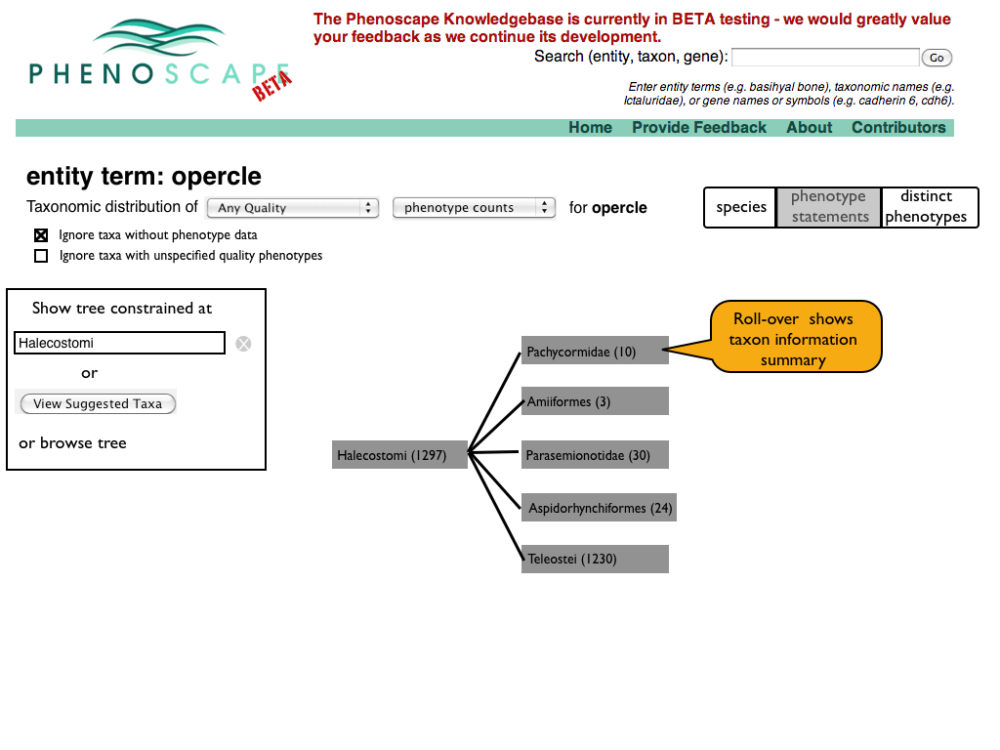
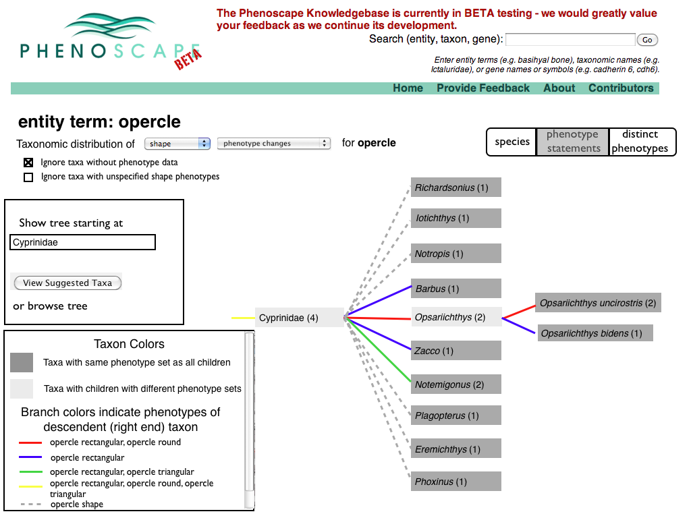
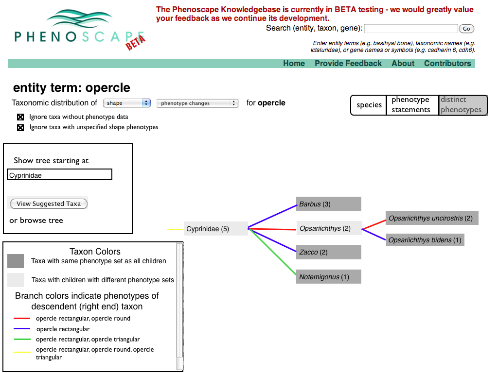

## Version 3 (19 April 2010)

### Slide 1: Intro

<figure>

<figcaption>ChangesOnTrees.001-001.png</figcaption>
</figure>

### Slide 2: Intro

<figure>

<figcaption>ChangesOnTrees.002-001.png</figcaption>
</figure>

### Slide 3: Intro

<figure>

<figcaption>ChangesOnTrees.003-001.png</figcaption>
</figure>

### Slide 4: Start screen

<figure>

<figcaption>ChangesOnTrees.004-001.png</figcaption>
</figure>

### Slide 5: Selecting opercle

<figure>

<figcaption>ChangesOnTrees.005-001.png</figcaption>
</figure>

### Slide 6: opercle summary

Select taxonomic distribution of phenotypes (this page may be out of
sequence if there is another page between the one on slide 5 and this
one). 

### Slide 7: Taxonomic Distribution of Phenotype Annotations

<figure>

<figcaption>ChangesOnTrees.007-001.png</figcaption>
</figure>

### Slide 8: Specifying the phenotype to attribute

<figure>

<figcaption>ChangesOnTrees.008-001.png</figcaption>
</figure>

### Slide 9: Selecting shape attribute

<figure>

<figcaption>ChangesOnTrees.009-001.png</figcaption>
</figure>

### Slide 10: Switching from counts of phenotype annotations to display of variability

<figure>

<figcaption>ChangesOnTrees.010-001.png</figcaption>
</figure>

### Slide 11: Phenotype variation display

<figure>

<figcaption>ChangesOnTrees.011-001.png</figcaption>
</figure>

### Slide 12: Selecting from a list of taxa where variability was detected

<figure>

<figcaption>ChangesOnTrees.012-001.png</figcaption>
</figure>

### Slide 13: Phenotype variation display for Characidae

<figure>

<figcaption>ChangesOnTrees.013-001.png</figcaption>
</figure>

### Slide 14

<figure>

<figcaption>ChangesOnTrees.014-001.png</figcaption>
</figure>

### Slide 15

<figure>

<figcaption>ChangesOnTrees.015-001.png</figcaption>
</figure>

### Slide 16

<figure>

<figcaption>ChangesOnTrees.016-001.png</figcaption>
</figure>

### Slide 17

<figure>

<figcaption>ChangesOnTrees.017-001.png</figcaption>
</figure>

### Slide 18

<figure>

<figcaption>ChangesOnTrees.018-001.png</figcaption>
</figure>

### Slide 19

<figure>

<figcaption>ChangesOnTrees.020-001.png</figcaption>
</figure>

### Captioned Alternative (compare slide 13)

<figure>

<figcaption>CaptionedVersion.013-001.png</figcaption>
</figure>

## Version 2

### Slide 1: Modifying Distribution of Taxonomic Distribution page

<figure>

<figcaption>ChangesOnTrees.001.png</figcaption>
</figure>

### Slide 2: Taxonomic Distribution of Distinct Phenotypes

<figure>

<figcaption>ChangesOnTrees.002.png</figcaption>
</figure>

### Slide 3: Summary of change counting

<figure>

<figcaption>ChangesOnTrees.003.png</figcaption>
</figure>

### Slide 4: Taxonomic Distribution Phenotype Changes

<figure>

<figcaption>ChangesOnTrees.004.png</figcaption>
</figure>

### Slide 5: Multiple Matches of Phenotype per Taxon

<figure>

<figcaption>ChangesOnTrees.005.png</figcaption>
</figure>

## Notes from April 7, 2010 meeting

Attending: Wasila Dahdul, Todd Vision, Paula Mabee, Peter Midford.

TJV suggested adding a toggle to suppress display of taxa without
phenotypes in both the annotation count and distinct phenotype counts
(e.g., no zero counts). There was strong sense that the exist use case
write-ups weren't quite sufficient to build use scenarios for testing -
how might a user get to the point of asking the questions slides 2&4
would answer. In particular, if the user was interested in changes in a
particular phenotype, starting from either a taxon summary or a
zebrafish gene summary, how could they identify an appropriate taxonomic
scope for the query. After PM left the meeting, TJV it should be
possible to go from a phenotype page to a list of taxa where change was
detected. This list might take the form of a taxonomy tree pruned to
include only the taxa where changes occurred. From this tree, the user
could select a taxon to root the taxonomic distribution display.

TJV also suggested that the displays on slides 2&4 should be merged -
use a different form of highlighting to indicate nodes where change
occurred (union of annotations of daughters not equal the intersection
of annotations). There was some discussion of the current highlighting
with a thickened border to indicate the focal node in the display
(apparently this came out of discussion in Chicago). TJV suggested maybe
changing the gray level in taxon boxes where change was detected. It was
also suggested that colors on branches could be used to identify
annotation sets of daughters (not individual annotations). This would
allow seeing which daughters had the same sets of phenotypes and a
legend could be added to specify the phenotype sets associated with each
color. This would supplement, but wouldn't necessary supersede the
pop-up on slide 2 (also intended for slide 4).

We did not discuss slide 5 as the use case it addressed (multiple
matches of a phenotype in a single taxon) was considered too low a
priority to devote effort to at this point.

## Version 1

### Slide 1: Intro page

<figure>

<figcaption>ChangeAndCorrelation.001.png</figcaption>
</figure>

### Slide 2: January Tree Display

<figure>

<figcaption>ChangeAndCorrelation.002.png</figcaption>
</figure>

### Slide 3: Current Tree Co-occurance Display

<figure>

<figcaption>ChangeAndCorrelation.003.png</figcaption>
</figure>

### Slide 4: A Phenotype by Taxon matrix we could have had

<figure>

<figcaption>ChangeAndCorrelation.004.png</figcaption>
</figure>

### Slide 5: A tree with negative data and a detected change

<figure>

<figcaption>ChangeAndCorrelation.005.png</figcaption>
</figure>

### Slide 6: A Phenotype by Taxon matrix with negative annotations

<figure>

<figcaption>ChangeAndCorrelation.006.png</figcaption>
</figure>

### Slide 7: Change and Correlation diagrams and overview

<figure>

<figcaption>ChangeAndCorrelation.007.png</figcaption>
</figure>

### Slide 8: Change Detection using incompatible qualities

<figure>

<figcaption>ChangeAndCorrelation.008.png</figcaption>
</figure>

### Slide 9: Change Detection between individuals, using gene-tree species-tree

<figure>

<figcaption>ChangeAndCorrelation.009.png</figcaption>
</figure>

### Slide 10: Disjoint_with and incompatible qualities

<figure>

<figcaption>ChangeAndCorrelation.010.png</figcaption>
</figure>

### Slide 11: Changing PATO

<figure>

<figcaption>ChangeAndCorrelation.011.png</figcaption>
</figure>

### Slide 12: Patching Process Flow

<figure>

<figcaption>ChangeAndCorrelation.012.png</figcaption>
</figure>

### Slide 13: PATO breakdown by attribute

<figure>

<figcaption>ChangeAndCorrelation.013.png</figcaption>
</figure>

### Slide 14: Incompatibility and Relational Qualities

<figure>

<figcaption>ChangeAndCorrelation.014.png</figcaption>
</figure>

### Slide 15: Transition to Correlation

<figure>

<figcaption>ChangeAndCorrelation.015.png</figcaption>
</figure>

### Slide 16: Correlation and Contingency Tables

<figure>

<figcaption>ChangeAndCorrelation.016.png</figcaption>
</figure>

### Slide 17: Reasoning only takes us so far

<figure>

<figcaption>ChangeAndCorrelation.017.png</figcaption>
</figure>

## Notes from March 30, 2010 meeting

Attending: Jim Balhoff, Wasila Dahdul, Cartik Kothari, Todd Vision,
Paula Mabee, Hilmar Lapp, Monte Westerfield, Peter Midford.

Peter presented the preceding slides. There was some discussion of the
definition of disjoint, as mentioned on slide 5. OBO's definition refers
to classes with no common members (as does OWL's). PM pointed out that
entities related by develops_from may exhibit incompatible qualities.
This might be a general problem related to temporal reasoning (entities
changing qualities over time).

TJV questioned the need for optimization for the use case of placing a
phenotype change on a tree, citing the example of identifying where on a
tree a change corresponding to a phenotype of a zebrafish gene mutation.
Peter did not have an immediate answer for this.

There was discussion of the difference between annotation of phenotype
differences between taxa, which might explicitly reference other taxa,
and zebrafish gene phenotypes which implicitly refer to the wild type.

TJV mentioned liking the current Phenotype Profile interface (taxon tree
on slide 3) and seemed to indicate that he thought showing contrasts in
co-occurrence counts between sister taxa was good enough. HL observed
that although the use cases did mention correlation, the usage was loose
and that co-occurrence was closer to the intended meaning.

Overall the sense was that optimization was not required for the use
cases we are planning to deliver by the end of the initial grant. Also
that the issue of incompatible qualities is messy and it wasn't
absolutely clear that we needed to address it at this point. PM asked
Peter to send her some use cases to review.

JPB doubted whether adding disjoint_from relations between PATO
qualities was sufficient and pointed out that almost any quality
annotation to an entity is incompatible with an absent annotation. JPB
thinks that handling this by adding a collection of disjoint_from
relations would probably not work. HL brought up the issue of count
ranges (e.g., 0-5, which is implicitly a polymorphism including absence
as a possible 'state'). Count values will need special treatment in any
approach to incompatibility as current curation practice is to put them
in comment strings.

There were numerous audio problems with Adobe connect and we eventually
switched to phones for the audio.
