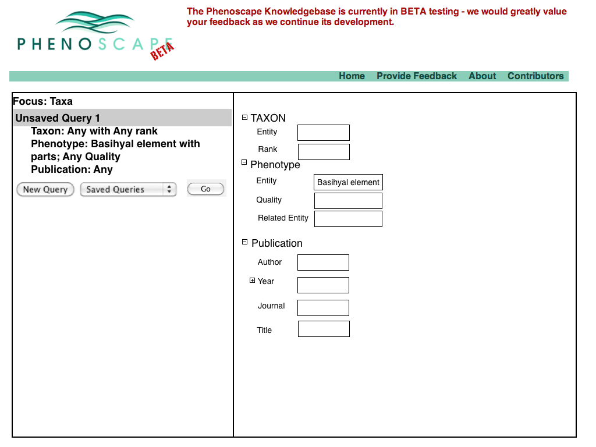
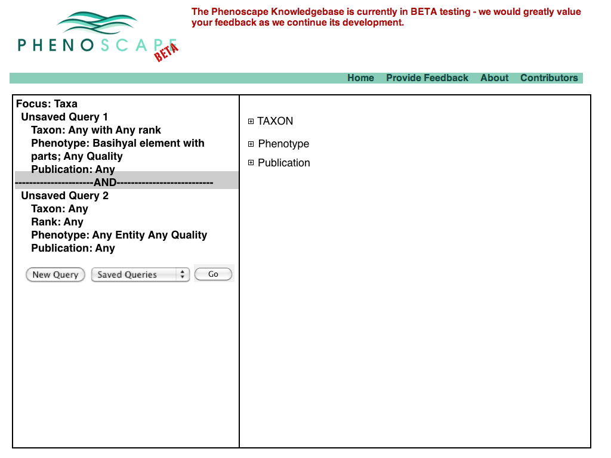
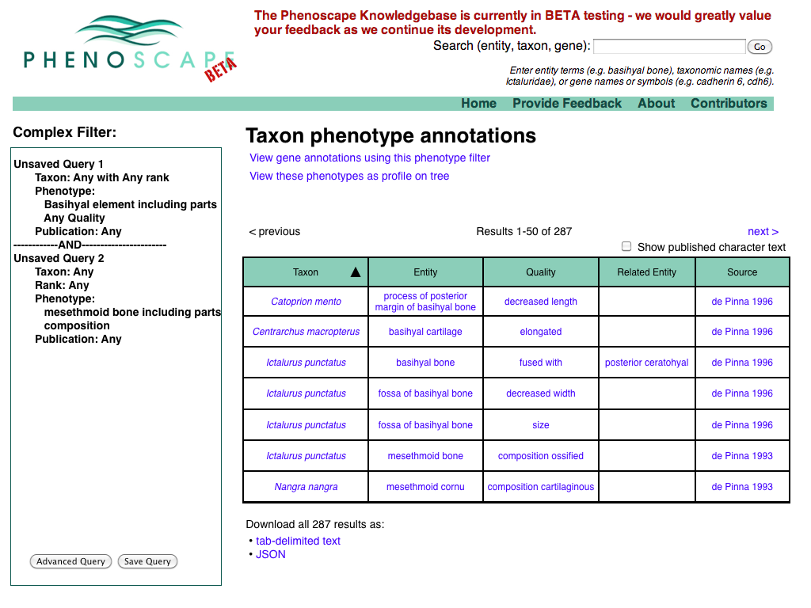
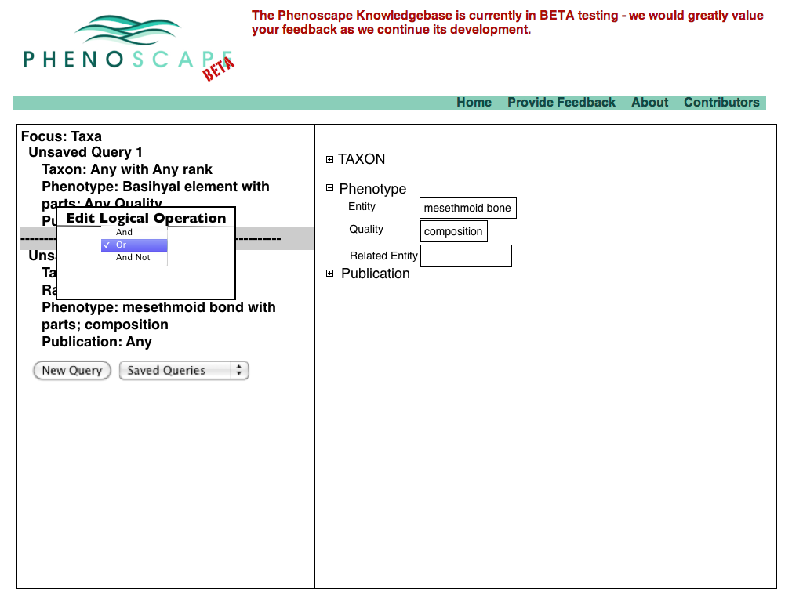
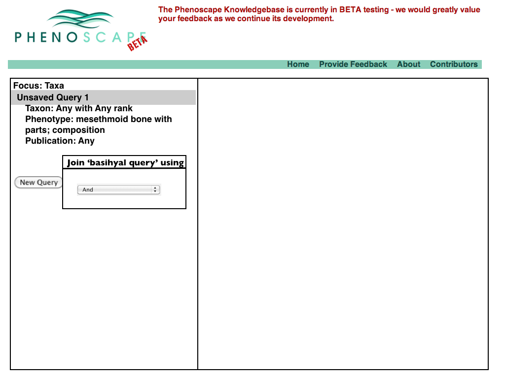
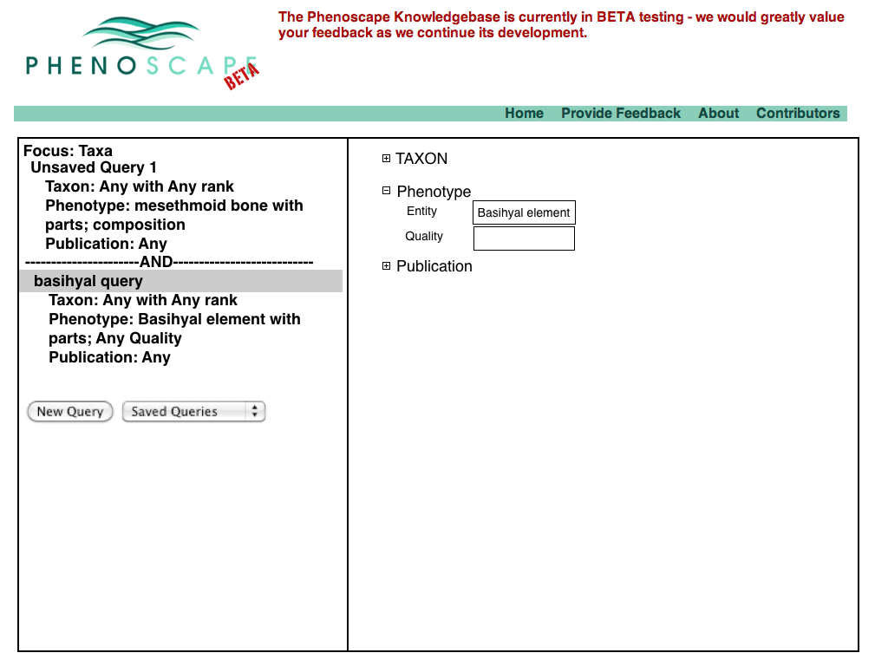
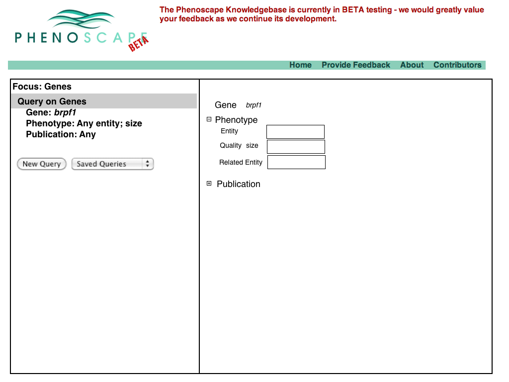
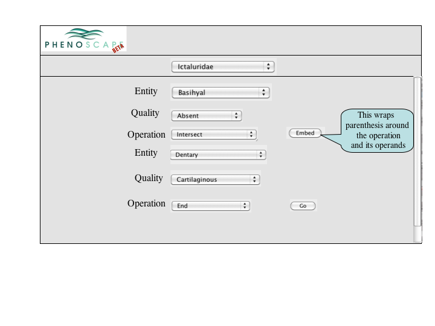

# Complex Query Specification

## Version 4

### Buttons for advanced query

<figure>

<figcaption>NewAdvancedQuery.001.png</figcaption>
</figure>

### Save a query

<figure>

<figcaption>NewAdvancedQuery.002.png</figcaption>
</figure>

### Enter advanced query page

<figure>

<figcaption>NewAdvancedQuery.003.png</figcaption>
</figure>

### Additional Fields (suggestions?)

<figure>

<figcaption>NewAdvancedQuery.004.png</figcaption>
</figure>

### Add a new subquery

<figure>

<figcaption>NewAdvancedQuery.005.png</figcaption>
</figure>

### Subquery available

<figure>

<figcaption>NewAdvancedQuery.006.png</figcaption>
</figure>

### Fill in subquery

- Need a go button - maybe drop on tool bar?

<figure>

<figcaption>NewAdvancedQuery.007.png</figcaption>
</figure>

### Results

<figure>

<figcaption>NewAdvancedQuery.008.png</figcaption>
</figure>

### Alternative Start from mesethmoid query

- Can change the logical operation in a drop-down

<figure>

<figcaption>NewAdvancedQuery.009.png</figcaption>
</figure>

<figure>

<figcaption>NewAdvancedQuery.010.png</figcaption>
</figure>

### Change to disjunction returns more results

<figure>

<figcaption>NewAdvancedQuery.011.png</figcaption>
</figure>

<figure>

<figcaption>NewAdvancedQuery.012.png</figcaption>
</figure>

### Add saved basihyal query

<figure>

<figcaption>NewAdvancedQuery.013.png</figcaption>
</figure>

### And specify the connective

<figure>

<figcaption>NewAdvancedQuery.014.png</figcaption>
</figure>

<figure>

<figcaption>NewAdvancedQuery.015.png</figcaption>
</figure>

### Should give same results

<figure>

<figcaption>NewAdvancedQuery.016.png</figcaption>
</figure>

### Advanced query also available from gene search

<figure>

<figcaption>NewAdvancedQuery.017.png</figcaption>
</figure>

### Gene query details

<figure>

<figcaption>NewAdvancedQuery.018.png</figcaption>
</figure>

## Notes for a Version 3

A number of approaches to a complex query have been suggested. Since Jim
has added a simple query to many of the summary pages, the focus of a
complex query is on covering the types of queries that can't be
expressed in the standard query. An appropriate visualization of a query
ought to be very explicit and could, secondarily let users check the
semantics of a simple query (e.g., make the implicit disjunctions within
categories and conjunctions between categories explicit). To this latter
end, and as a way for users to discover how complex queries work, a
button or link to a complex query page should be available at the bottom
of every simple query panel. When selected, the contents of the simple
query will be copied into the complex query page, establishing both a
starting point for the user to build on and a correspondence back to the
simple query.

### List of suggested query models

- <a href="http://www.biomart.org_Biomart" class="wikilink"
  title="http://www.biomart.org Biomart">http://www.biomart.org
  Biomart</a>
- <a href="http://www.gusdb.org/wdk_Strategies_Web_Development_Kit"
  class="wikilink"
  title="http://www.gusdb.org/wdk Strategies Web Development Kit">http://www.gusdb.org/wdk
  Strategies Web Development Kit</a>
  - examples at
    <a href="http://plasmodb.org/plasmo_PlasmoDB" class="wikilink"
    title="http://plasmodb.org/plasmo PlasmoDB">http://plasmodb.org/plasmo
    PlasmoDB</a>.
- <a
  href="http://compbio.charite.de/Phenomizer/Phenomizer.html_Phenomizer"
  class="wikilink"
  title="http://compbio.charite.de/Phenomizer/Phenomizer.html Phenomizer">http://compbio.charite.de/Phenomizer/Phenomizer.html
  Phenomizer</a>
- <a href="http://www.arb-silva.de/search/ontogrator/_Ontogrator"
  class="wikilink"
  title="http://www.arb-silva.de/search/ontogrator/ Ontogrator">http://www.arb-silva.de/search/ontogrator/
  Ontogrator</a>
- Other 'list oriented' queries (e.g., fogbugz, mail.app, etc.)

## Version 2

### Entry from Taxon Page

<figure>

<figcaption>Biomart126_1.png</figcaption>
</figure>

<figure>

<figcaption>BioMart126_2.png</figcaption>
</figure>

<figure>

<figcaption>BioMart126_3.png</figcaption>
</figure>

<figure>

<figcaption>BioMart126_4.png</figcaption>
</figure>

<figure>

<figcaption>BioMart126_5.png</figcaption>
</figure>

<figure>

<figcaption>BioMart126_6.png</figcaption>
</figure>

<figure>

<figcaption>BioMart126_7.png</figcaption>
</figure>

<figure>

<figcaption>BioMart126_8.png</figcaption>
</figure>

<figure>

<figcaption>BioMart126_9.png</figcaption>
</figure>

<figure>

<figcaption>BioMart126_10.png</figcaption>
</figure>

<figure>

<figcaption>BioMart126_11.png</figcaption>
</figure>

<figure>

<figcaption>BioMart126_12.png</figcaption>
</figure>

### Entry from Phenotype Page

<figure>

<figcaption>BioMart126_14.png</figcaption>
</figure>

### Entry from Gene Page

<figure>

<figcaption>BioMart126_16.png</figcaption>
</figure>

### Entry from Publication Page

\[\[Image:BioMart126_18.png\]

### Version 1

### Entry of phenotype specification

#### Single Pane Set Algebra interface

<figure>

<figcaption>ComplexQuery1.png</figcaption>
</figure>

<figure>

<figcaption>ComplexQuery2.png</figcaption>
</figure>

<figure>

<figcaption>ComplexQueryAlgebraBox.png</figcaption>
</figure>

#### Phenotype on Tree Mapping Specification

<figure>

<figcaption>TreeDisplayQuery.png</figcaption>
</figure>

#### Biomart style interface

<figure>

<figcaption>BioMart1.png</figcaption>
</figure>

<figure>

<figcaption>BioMart2.png</figcaption>
</figure>

### Version 0

- user enters a phenotype specification, presses Done

<figure>

<figcaption>queries1.png</figcaption>
</figure>
