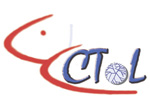
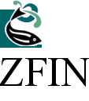
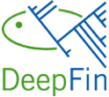
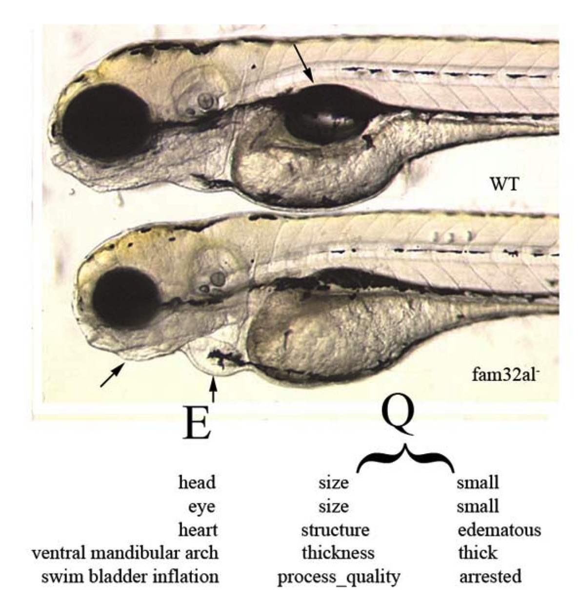

This was the front page of this project wiki from June 1, 2007 to July
31, 2011, while it was funded (under the title of this page) by NSF
grant BDI-0641025.

## Linking Evolution to Genomics Using Phenotype Ontologies

<figure>

<figcaption>NESCent_Logo.png</figcaption>
</figure>

### About this project

What are the developmental and genetic bases of evolutionary differences
in morphology across species? Currently it is difficult to approach this
question due to a lack of computational tools that allow researchers to
integrate developmental genetic and comparative morphological/anatomical
data.

  We
are addressing this by developing a database of evolutionarily variable
morphological characters for a large clade of fishes (the Ostariophysi)
and connecting this database to the large collection of mutant
phenotypes in the [ZFIN database](http://zfin.org), the central database
of the zebrafish model organism community. The evolutionary and mutant
phenotypes are being described using common
<a href="#The_Role_of_Ontologies" class="wikilink"
title="ontologies">ontologies</a>. The database with its web-interface,
together with the extended ontologies and data curation tools, will
allow researchers to ask novel questions about the genetic and
developmental regulation of evolutionary morphological transitions. Tool
and database development are being guided by [use
cases](http://en.wikipedia.org/wiki/Use_case), or driving research
questions, defined by the devo-evo community. These tools are being
developed under an open-source, open-development model, and in such a
way that they can be used for additional biological systems in the
future.

 This project is a unique
collaboration between evolutionary and model organism biologists
including two national centers ([NESCent](http://www.nescent.org) and
[NCBO](http://www.bioontology.org)), the [ZFIN model organism
database](http://zfin.org), the [Cypriniformes Tree of
Life](http://bio.slu.edu/mayden/cypriniformes/home.html) project, the
[DeepFin Research Coordination Network](http://www.deepfin.org/), and
the morphological image databases used by the evolutionary biology
community.

### The Role of Ontologies

<figure>

<figcaption>Ncbo_logo.gif</figcaption>
</figure>

#### Background

Ontologies are constrained, structured vocabularies with well defined
relationships among terms. Ontologies represent the knowledge of a
particular discipline and provide not only a mechanism for consistent
annotation of data, but also greater interoperability among people and
machines. The most widely used biological ontology is the [Gene
Ontology](http://www.geneontology.org), which is utilized to annotate
molecular function, biological processes and subcellular localization to
gene products from different organisms.

#### Phenotype ontologies

 Approximately 500 mutant
zebrafish lines (alleles) with over 660 annotated phenotypic characters
from the jaw or gill arches, fins, axial skeleton and other features of
the skeleton have been described. Curators in the [Zebrafish Information
Network](http://www.zfin.org) (ZFIN) are annotating mutant phenotypes
using the [zebrafish anatomy
ontology](http://obofoundry.org/cgi-bin/detail.cgi?id=zebrafish_anatomy&title=Zebrafish%20anatomy%20and%20development)
and the [Phenotype And Trait
Ontology](http://www.bioontology.org/wiki/index.php/PATO:Main_Page)
(PATO). PATO is a “universal” ontology of terms describing qualities
(e.g. shape, color, size) that may be applied to any organism.

#### Anatomical ontologies

We have initiated a multi-species ontology for ostariophysan fishes, the
<a href="Teleost_Anatomy_Ontology" class="wikilink"
title="Teleost Anatomy Ontology">Teleost Anatomy Ontology</a> (TAO)
([Dahdul et al, 2010](http://dx.doi.org/10.1093/sysbio/syq013)), which
was initialized with the terms in the zebrafish anatomical ontology. The
development of the TAO is currently focused on the skeletal system
because it varies significantly across the Ostariophysi, is
well-preserved in fossil specimens, and it is often the focus of
morphologically-based evolutionary studies in ichthyology.

This multi-species anatomy ontology is being used in combination with
the PATO ontology (see EQ format) to describe the comparative
morphological characters. We have also developed a separate catalog of
homology statements for entities within the TAO, so that individual
investigators may select particular relationships based on evidence.

#### Taxonomic ontology

Together with taxonomic experts, we have developed a taxonomic ontology
(based on the [Catalog of
Fishes](http://www.calacademy.org/RESEARCH/ichthyology/catalog/fishcatsearch.html))
to relate species with particular characters and states. The taxonomic
ontology will include nodes ancestral to the Ostariophysi as far back as
the Vertebrata in order to associate certain anatomical terms with more
inclusive clades than the Ostariophysi.

#### Fish Morphology

Although the comparative anatomy of fishes has been documented in the
literature for several hundred years, it is not available in a
computable format. With the help of taxon experts for ostariophysan
fishes, we prioritized 76 papers for curation; these can be viewed on
our publicly available [Google
spreadsheet](http://spreadsheets.google.com/ccc?key=pTeXfTnVPxC-P1URVHbI4Qg).
51 have been completely curated and consistency checked and are
available for searching in the Knowledgebase. We achieved our goal to
input approximately 5,000 morphological features ([Dahdul et al,
2010](http://dx.plos.org/10.1371/journal.pone.0010708)) in an “EQ”
format (<a href="Media:TREE_Mabee.pdf" class="wikilink"
title="Mabee et al. 2007a">Mabee et al. 2007a</a>) using a combination
of ontologies.

### Contact

Paula Mabee (University of South Dakota) is the Principal Investigator.
Co-principal investigators are Todd Vision (University of North
Carolina, Chapel Hill), Monte Westerfield (University of Oregon, ZFIN),
and Hilmar Lapp (NESCent) (<a href="Contact" class="wikilink"
title="see their contact addresses">see their contact addresses</a>).

## Acknowledgments

<table>
<tbody>
<tr>
<td>
This project was funded by NSF grant BDI-0641025, and supported
by the National Evolutionary Synthesis Center (NESCent), NSF
#EF-0423641. 
 
This project arose from a NESCent <a
href="http://www.nescent.org/science/workinggroup.php">Working
Group</a> led by Paula Mabee and Monte Westerfield, "Towards an
Integrated Database for Fish Evolution." <a
href="Fish_Evolution_Working_Group" class="wikilink"
title="Goals and summaries of the group">Goals and summaries of the
group</a> are archived on this wiki.
</td>
<td>
<a
href="http://www.nescent.org/about/images/nsf_logo.jpg">http://www.nescent.org/about/images/nsf_logo.jpg</a>
</td>
</tr>
</tbody>
</table>
