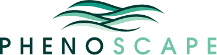

## Phenoscape Logo

Here is the final logo in several file types. The PNG and GIF versions
are transparent.

     

## Logo Design Contest

Post your ideas here. Fabulous prizes to be had!!!

### Aug 27, 2007 Hilmar Lapp wrote:

The logo might as well be more abstract. I'm thinking it ought to be
possible to photoshop one of those bizarre looking stained fish bones
into an abstract image that's as edgy as the project name. And wouldn't
that be morph(ing a )phen(otyp)e?

### Aug 27, 2007 Wasila Dahdul wrote:

That "morphing" idea is appealing -- it would even be fun to have images
morph into one another, similar to what CAS fish department has on their
[website](http://www.calacademy.org/research/ichthyology/).
