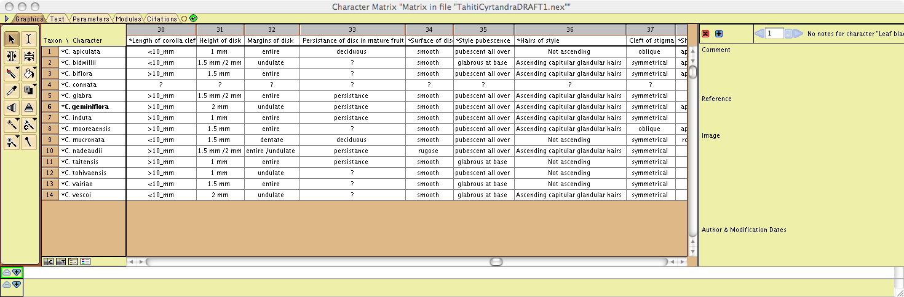
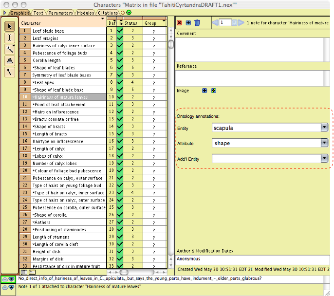
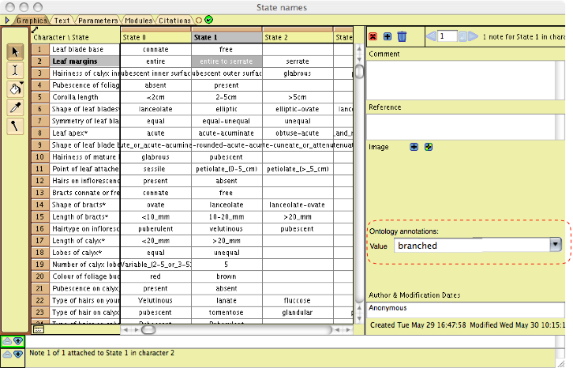

[Mesquite](http://mesquiteproject.org/mesquite/mesquite.html) is
"software for evolutionary biology, designed to help biologists analyze
comparative data about organisms." Mesquite is written in Java and
supports extension via third-party modules. It natively provides editing
of evolutionary character matrices:

<figure>

<figcaption>Mesquite-matrix.png</figcaption>
</figure>

Mesquite support annotations for characters, character states, and taxa,
including textual comments and images. One idea is to add an interface
for ontological terms as part of the annotations. Here are some
examples:

<figure>

<figcaption>Mesquite characters list|center|700px</figcaption>
</figure>

<figure>

<figcaption>Mesquite character states list|center|700px</figcaption>
</figure>
