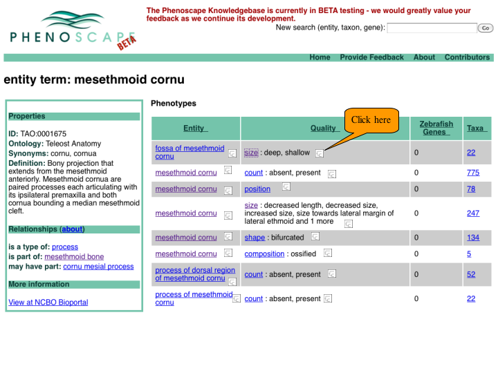
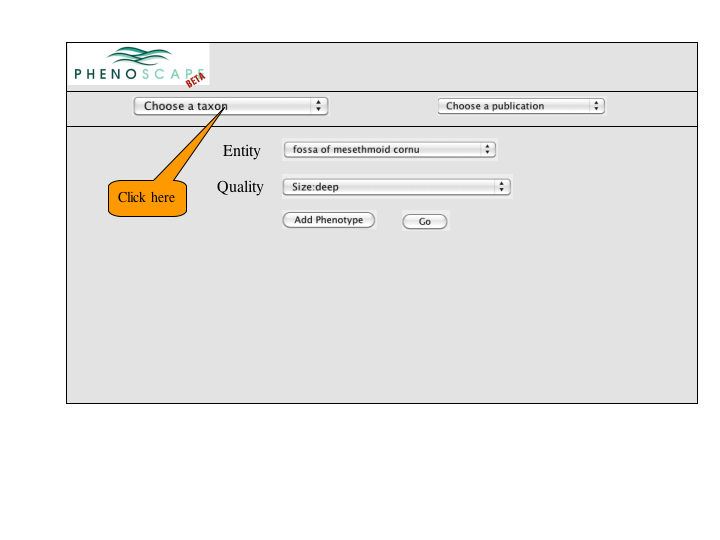
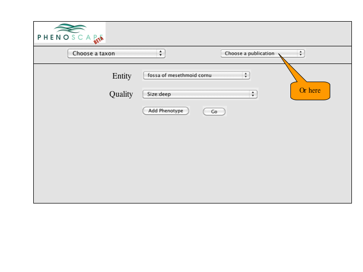

## Version 3

### Access from Tree Buttons in Quality Column

<figure>

<figcaption>MapMultiplePhenotypes1.png</figcaption>
</figure>

### Tree Display and Query Refinement

<figure>

<figcaption>MapMultiplePhenotypes2a.png</figcaption>
</figure>

## Version 2

### Access from Tree Buttons in Quality Column

<figure>

<figcaption>MapMultiplePhenotypes1.png</figcaption>
</figure>

### Multiple Phenotype Selection Panel

### Tree Display

<figure>

<figcaption>MapMultiplePhenotypes7.png</figcaption>
</figure>

## Version 1

<figure>

<figcaption>MultiplePhenotypesOnTree.png</figcaption>
</figure>

## Version 0

- user can enter phenotype specification for each "state"
- see on tree which branches exhibit one or both of the phenotypes
- Do users want the tree "pruned"? Or show branches without annotations
  also? could be a lot of taxa

<figure>

<figcaption>trees1.png</figcaption>
</figure>

### Same interface

- shows that the 2 phenotypes don't have to be obvious alternatives

<figure>

<figcaption>trees2.png</figcaption>
</figure>

### Map phenotypes of a given entity on tree
