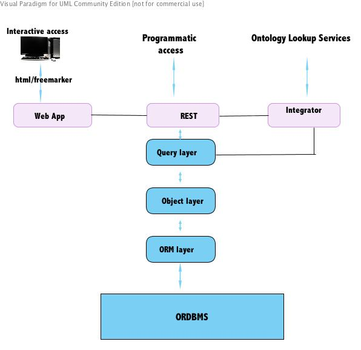
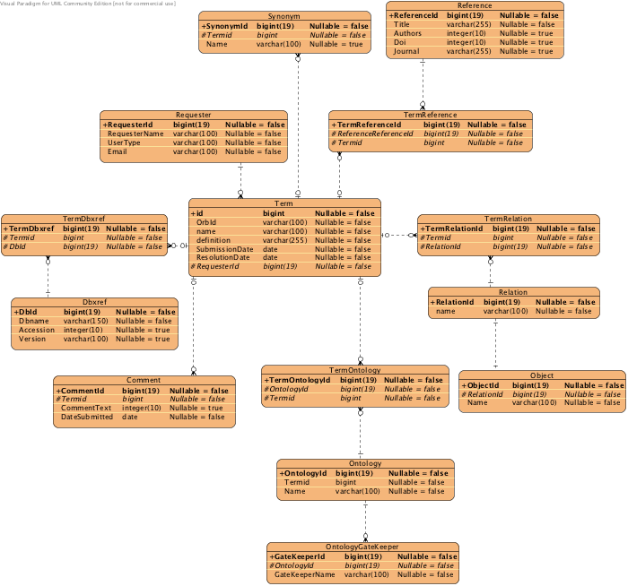

## Introduction

The vision of this project is to develop an application that will allow
data curators to use new ontology terms without creating a workflow
bottleneck.

### Background

There is a need for applications that will expedite the annotation of
phenotypic characters using ontologies and also promote community
participation in the expansion and refinement of ontologies. One
particular need that has arisen within Phenoscape and other projects is
for an Ontology Request Broker (ORB), an application that can launch new
ontology term requests within existing data curation workflows, record
term provenance and community discussion, enable temporary terms to be
used in data annotation, and update temporary terms once a request has
been resolved.

### Scope

Here is a documentation of ORB term request service. ORB will be
accessible via an online interface and programmatically through RESTful
web-services.

### ORB architecture overview

<figure>

<figcaption>ORB_arch.jpg</figcaption>
</figure>

## Use cases

**Case:Place a term request within an ontology annotation
application**  
Brief: One of the key challenges in ontological data annotation is
placing a new term request.During annotation, a user normally has to
switch from his/her annotation platform/application ( for
example[Phenex](https://www.phenoscape.org/wiki/Phenex)) to a different
URL (such as sourceforge based term tracker) to place a request. This
poses a bottleneck to efficient data annotation especially in
large-scale projects. An annotator working with an annotation
application integrating ORB's submit term request service, can submit a
new request and receive a temporary ID to work with before the requested
term is assigned an official ontology ID.

Actor: annotator of data using ontology terms

Pre-condition: -The antology annotation application being used is
integrated to ORB's submit term request service

Ideal path The process is initiated when the user initiates new term
request within the annotation application

1.  A GUI for term submission is generated
2.  User completes the term submission fields
3.  User clicks on the submit button
4.  ORB validates the request
5.  ORB informs the user of successful term submission and provides a
    temporary ID(referred to as ORB ID) assigned to the term
6.  Adds the new request to the database

Invalid path : This occurs when the user submits an invalid request

1.  ORB alerts the user that the request is invalid
2.  ORB return the term submission GUI with the invalid field(s)
    highlighted

------------------------------------------------------------------------

**Case:Get term from the ontology annotation application**  
Brief: After placing a term request, a ontology annotator would like to
find out if the term has been resolved (i.e assigned the correct name
and ontology ID).

Actor: ontology annotator

Pre-condition -The antology annotation application being used is
integrated to ORB's get term via orb ID service. Ideal path The process
is initiated when the user initiates get term via ORB ID within the
annotation application

1.  A GUI for inserting the ORB ID is generated
2.  User inserts the ID
3.  User clicks on the submit button
4.  ORB validates the request
5.  ORB informs user that the term has been resolved and returns the
    resolved term's name, ontology ID, definition plus other related
    information

Alternative paths:

If the term is still pending

1.  ORB informs the user that the term is still pending and returns the
    term's name, ORB ID plus any other updates relating to the term

If the term is obsoleted

1.  ORB informs user that the term has been obsoleted and returns the
    suggested correct ontology term if one exists
2.  ORB also returns any comments that may give a clue to the user why
    the term was obsoleted

If a term matching the ORB ID is not found

1.  ORB informs user that no match was found
2.  ORB suggests to the user to verify if the ORB ID provided was
    correct an if he/she wants to re-submit another ORB ID

------------------------------------------------------------------------

**Case:Register**  
Brief: This is a use case for creating an account in ORB

Actor:ORB user

Pre-condition: The user is at the ORB site

Ideal path The process is initiated when the user selects the
registration link

1.  ORB presents the registration page
2.  User provides required fields(e-mail,name, password and country)
3.  User submits his/her information
4.  ORB verifies the request
5.  ORB informs the user of successful registration and provides an
    activation link
6.  ORB sends the registration information to the user's e-mail account

Alternative path Invalid request: This occurs when a user submits a
request with missing required information

1.  The steps 1 to 4 in the ideal path apply
2.  ORB terminates the registration
3.  ORB returns to the registration page with the missing field
    highlighted

Invalid e-mail address: This occurs when a user provides an invalid
e-mail address

1.  The steps 1 to 4 in the ideal path apply
2.  ORB terminates the registration
3.  ORB informs user the e-mail address is invalid
4.  ORB returns the registration page

------------------------------------------------------------------------

**Case:SubmitTerm**

Brief: This is a use case for submitting new ontology term requests.

Actor: TermRequester

Pre-conditions: The requester must be at the ORB website and has an
account

Ideal path:

1.  This use case is initiated when the requester clicks on the term
    submission tab
2.  ORB presents the user login page for the requester to fill in the
    name and password
3.  ORB verifies the requester
4.  ORB displays the term submission page
5.  Requester provides the required fields(i.e term's name, parent,
    textual definition,target ontology) plus any additional information
    related to the term (i.e other relations, references, database cross
    references, comments etc) and submits
6.  ORB verifies the submission
7.  ORB assigns a temporary ID to the term and presents it the requester
8.  ORB sends the requested term's temporary ID and other details to
    requester's e-mail account
9.  ORB returns to the term submission page

Alternative paths:

Invalid request: This occurs if the user submits a request without the
required fields

1.  Steps 1 to 6 as described in the ideal path will apply
2.  ORB will the terminate the request
3.  ORB will return to the term submission page with the missing
    required field highlighted

Matching term found: This occurs when the requested term already exists
in the targetted ontology

1.  Steps 1 to 6 as described in the ideal path will apply
2.  ORB returns a message informing the requester that the term exists
3.  ORB returns the matching term's id, name and parent to the requester

------------------------------------------------------------------------

**Case: EditTerm**

Brief: This is a use case for editing requested term

Actor: TermRequester and OntologyGateKeeper

Pre-conditions

- The term exists in ORB database
- The term has not been resolved
- The term editor is at the specific term's page

Ideal path: This case is initiated when the
TermRequester/OntologyGateKeeper selects the "edit term" link

1.  ORB presents the user login page
2.  User provides their name and password
3.  ORB verifies the user
4.  ORB presents the term with the editable fields
5.  User makes any changes and submits
6.  ORB verifies the changes made
7.  ORB updates changes
8.  ORB informs user of successful update
9.  ORB displays the term plus the new changes

Alternative paths:

User not registered

1.  Steps 1 to 3 as described in the ideal path apply
2.  ORB terminates the process
3.  ORB informs the user that they are not registered or need to try
    again in case of misspelled login details
4.  ORB presents the ORB registration page

User neither the requester of the term nor gatekeeper for the target
ontology

1.  Steps 1 to 3 as described in the ideal path apply
2.  ORB terminates the process
3.  ORB informs the user that they need to be the term's requester or
    ontology gatekeeper to edit the term
4.  ORB returns to the term page

------------------------------------------------------------------------

**Case:ChangeTermStatus**

Brief: This is a use case for changing the status a term submitted

Actor: OntologyGateKeeper

Pre-condition: The user is at the specific term page

Ideal path This case is initiated when the user,selects the "change term
status" link

1.  ORB presents the user login page
2.  User provides their name and password
3.  ORB verifies the user
4.  ORB presents the term with the editable status fields
5.  User selects the new status and submits
6.  ORB updates changes
7.  ORB informs user of successful update
8.  ORB displays the term plus the updated status

Alternative paths

Invalid OntologyGateKeeper

1.  Steps 1 to 3 as described in the ideal path will apply
2.  ORB terminates the request
3.  ORB informs the user that they aren't the ontology gatekeeper or
    they may try again in case of misspelled login information
4.  ORB returns to term page

Resolved term status: This applies when a term has already been resolved
and assigned a permanent ID

1.  Steps 1 to 3 as described in the ideal path will apply
2.  ORB terminates the request
3.  ORB informs the user that the term has been resolved
4.  ORB returns to the term page

------------------------------------------------------------------------

**Case:BrowseTerms**

Actor: CasualUser

Brief:This is a case for user who is navigating the ORB site

Pre-Condition:

- The user is online at the ORB site

Ideal path

1.  The user selects the "browse terms" link
2.  ORB displays the ORB browse term page
3.  User selects whether to view all terms or based on status
4.  ORB displays the terms name , ID , target ontology, status and a
    link to the terms page

Alternative paths:

**Case: DownloadTerms**

Brief: Use case for downloading terms

1.  Steps 1 to 4 as described in the ideal path apply
2.  User selects the terms to be downloaded
3.  User selects the download tab
4.  ORB generates a text file containing the terms in OBO format
5.  ORB returns to the page displaying downloaded terms

Download a term: Applicable when user wants to download a single term

1.  The steps 1 to 4 as described in the ideal path apply.
2.  User selects the term page link
3.  ORB displays the term page with all the term's information
4.  User selects the term download tab
5.  ORB generates a file containing the term in OBO format
6.  ORB returns to the term's page

**Case: SearchTerm** Brief: A case for user to search for a term

Ideal path:

1.  User selects the search term link
2.  ORB displays the term search page
3.  User provides the term name or id or parent
4.  User selects the submit button
5.  ORB returns a term with the name,synonyms or id matching the
    information provided in step 3

Alternative path:

No term matching the search

1.  Steps 1 to 3 as described in the ideal path apply
2.  ORB returns a term not found message

**Case: Comment**

Pre-condition: User is at the specific term's page

Ideal path

1.  User selects the "comment on term" link
2.  ORB provides a page for submitting a comment
3.  User provides comment in the term comment field
4.  User provides name and e-mail
5.  ORB validates the user e-mail
6.  User submits the comment
7.  ORB generates a comment submission success message
8.  ORB returns to the term page

Alternative path

User e-mail invalid

1.  Steps 1 to 5 as described in the ideal path apply
2.  ORB terminates the comment submission process
3.  ORB informs user about the invalid e-mail address
4.  ORB returns to the term comment submission page

------------------------------------------------------------------------

**Case: DevelopOrb**

Actor: Developer

Brief: This is a case for users who have skills in application
development and are interested in developing ORB further

Pre-conditions:

Ideal path:

Alternative paths:

------------------------------------------------------------------------

**Case:IntegrateOrb**

Actor : Developer

Brief: This is a case for users who have skills in application
development and are interested in integrating ORB into existing
application e.g to form a workflow.

Pre-conditions:

Ideal path:

Alternative path:

------------------------------------------------------------------------

## Non-functional requirements

**Accessibility**

- ORB will have a web interface for easy access via browsers
- It will also have REST-style web service for programmatic access
- The prototype will be integrated into
  [Phenex](https://www.phenoscape.org/wiki/Phenex) as a demonstration of
  an interfaceable API.

**Support**

- - A comprehensive documentation on ORB's functions(how
    to..),implementation and help pages
  - Registration and extensive documentation at
    [sourceforge](http://sourceforge.net/),
    [Biocatalogue](http://www.biocatalogue.org/) and [Phenoscape
    wiki](https://www.phenoscape.org/wiki/Main_Page)
  - Have a bug tracking and feature request mechanism

## Activity

## Installation

### Download source code

-To obtain the complete and latest version of the applications source,
visit the [SVN
link](https://phenoscape.svn.sourceforge.net/svnroot/phenoscape/orbprototype/)
-Download the project all files

### Build

-Run the ant based build file to generate the <i>orbprototype.war</i>
file

### Database

-Get the DDL scripts from the build step depending on the kind of DBMS
your are using e.g. for PostgreSQL, use ddl_postgres.sql. -Create a
database withing your DBMS with the parameters below:

`     database name: ontologyrequestbroker`  
`     password : orbprototype`

-Run the DDL script chosen above within the SQL interface or on command
line to create all the database tables and sequences.

### Establish connection to the database

## ORB database Entity-Relation(ER) diagram

<figure>

<figcaption>ORB_schema.png</figcaption>
</figure>

## Services

Here is a list of all the web-services provided by ORB. The base URI
(represented as, <BASE> in the services URIs) is: /orbprototype/

### Get all terms in html format

<b>Type :</b>html

<b>Protocol : </b> HTTP GET

<b>URI :</b><BASE>terms/?media=html

<b>Output :</b>User requested terms in html format

#### Example

GET /orbprototype/terms/?media=html HTTP/1.1

------------------------------------------------------------------------

### Get all terms in xml format

<b>Type :</b>xml

<b>Protocol : </b> HTTP GET

<b>URI :</b><BASE>terms/?media=xml

<b>Output :</b>User requested terms in xml format adhering to the [terms
XML
schema](https://www.nescent.org/wg/phenoscape/images/f/f3/Terms_xml_schema.txt)

#### Example

GET /orbprototype/terms/?media=xml HTTP/1.1

------------------------------------------------------------------------

### Get all obsoleted terms in htm format

<b>Type :</b>html

<b>Protocol : </b> HTTP GET

<b>URI :</b><BASE>terms/obsolete/?media=html

<b>Output :</b>All users requested terms that have been obsoleted in
HTML format

#### Example

GET /orbprototype/terms/obsolete/?media=html HTTP/1.1

------------------------------------------------------------------------

### Get all obsoleted terms in xml format

<b>Type :</b> xml

<b>Protocol : </b> HTTP GET

<b>URI :</b><BASE>terms/obsolete/?media=xml

<b>Output :</b>All users requested terms that have been obsoleted in xml
format adhering to the [terms XML
schema](https://www.nescent.org/wg/phenoscape/images/f/f3/Terms_xml_schema.txt)

#### Example

GET /orbprototype/terms/obsolete/?media=xml HTTP/1.1

------------------------------------------------------------------------

### Get all terms from an ontology with an ontology_identifier in HTML format

<b>Type :</b> html

<b>Protocol : </b> HTTP GET

<b>URI :</b><BASE>terms/ontology/{ontology_identifier}/?media=html  
:Note: The {ontology_identifier}refers to either the name or prefix of
an ontology e.g Teleost Anatomy Ontology (name) or TAO (prefix)

<b>Output :</b> All requested terms with the provided ontology as their
target in html format

#### Example

GET /orbprototype/terms/ontology/TAO/?media=html HTTP/1.1

------------------------------------------------------------------------

### Get all terms from an ontology with an ontology_identifier in xml format

<b>Type :</b> xml

<b>Protocol : </b> HTTP GET

<b>URI :</b><BASE>terms/ontology/{ontology_identifier}/?media=xml

  
Note: The ontology_identifier can either be a name or prefix of an
ontology

<b>Output :</b>All requested terms with the provided ontology as their
target in xml format adhering to the [terms XML
schema](https://www.nescent.org/wg/phenoscape/images/f/f3/Terms_xml_schema.txt)

#### Example

GET /orbprototype/terms/ontology/TAO/?media=xml HTTP/1.1

------------------------------------------------------------------------

### Get all pending terms in html format

<b>Type :</b> html

<b>Protocol : </b> HTTP GET

<b>URI :</b><BASE>terms/pending/?media=html

<b>Output :</b>All users requested terms that are pending in html format

#### Example

GET /orbprototype/terms/pending/?media=html HTTP/1.1

------------------------------------------------------------------------

### Get all pending terms in xml format

<b>Type :</b> xml

<b>Protocol : </b> HTTP GET

<b>URI :</b><BASE>terms/pending/?media=xml

<b>Output :</b>All users requested terms that are pending in xml format
adhering to the [terms XML
schema](https://www.nescent.org/wg/phenoscape/images/f/f3/Terms_xml_schema.txt)

#### Example

GET /orbprototype/terms/pending/?media=xml HTTP/1.1

------------------------------------------------------------------------

### Get all terms in html format using publication_identifier

<b>Type :</b> html

<b>Protocol : </b>HTTP GET

<b>URI :</b><BASE>terms/publication/{publication_identifier}/?media=html

  
Note: The publication_identifier can be a publication's DOI or title

<b>Output :</b>All requested terms with the provided publication as
their reference in html format

#### Example

GET /orbprototype/terms/publication/test/?media=html HTTP/1.1

------------------------------------------------------------------------

### Get all terms in xml format using publication_identifier(publication's DOI or title)

<b>Type :</b> xml

<b>Protocol : </b> HTTP GET

<b>URI :</b> <BASE>terms/publication/{publication_identifier}/?media=xml

<b>Output :</b>All requested terms with the provided publication as
their reference in XML format adhering to the [terms XML
schema](https://www.nescent.org/wg/phenoscape/images/f/f3/Terms_xml_schema.txt)

#### Example

GET /orbprototype/terms/publication/test/?media=xml HTTP/1.1

------------------------------------------------------------------------

### Get all terms in HTML format requested by {requester_identifier}

<b>Type :</b> html

<b>Protocol : </b> HTTP GET

<b>URI :</b> <BASE>terms/requester/{requester_identifier}/?media=html

  
Note : The requester_identifier is a text which could be the requester's
name or e-mail

<b>Output :</b> A list of terms matching the requester identifier
provided in html

#### Example

GET /orbprototype/terms/requester/test/?media=html HTTP/1.1

------------------------------------------------------------------------

### Get all terms in xml format requested by {requester_identifier}

<b>Type :</b> xml

<b>Protocol : </b>HTTP GET

<b>URI :</b><BASE>terms/requester/{requester_identifier}/?media=xml

  
Note: The requester_identifier is a text which could be the requester's
name or e-mail

<b>Output :</b>A list of terms matching the requester identifier
provided in xml adhering to the [terms XML
schema](https://www.nescent.org/wg/phenoscape/images/f/f3/Terms_xml_schema.txt)

#### Example

GET /orbprototype/terms/requester/test/?media=xml HTTP/1.1

------------------------------------------------------------------------

### Get all resolved terms in html format

<b>Type :</b> html

<b>Protocol : </b> HTTP GET

<b>URI :</b><BASE>terms/resolved/?media=html

<b>Output :</b> A list of all resolved terms in html format

#### Example

GET /orbprototype/terms/resolved/?media=html HTTP/1.1

------------------------------------------------------------------------

### Get all resolved terms in xml format

<b>Type :</b> xml

<b>Protocol : </b> HTTP GET

<b>URI :</b><BASE>terms/resolved/?media=xml

<b>Output :</b> A list of all resolved terms in xml format adhering to
the [terms XML
schema](https://www.nescent.org/wg/phenoscape/images/f/f3/Terms_xml_schema.txt)

#### Example

GET /orbprototype/terms/resolved/?media=xml HTTP/1.1

------------------------------------------------------------------------

### Get top terms in html format

<b>Type :</b> html

<b>Protocol : </b>HTTP GET

<b>URI :</b><BASE>terms/top/?media=htm

<b>Output :</b> A list of 10 (or less) terms with the highest number of
comments in html format

------------------------------------------------------------------------

### Get top terms in xml format

<b>Type :</b> xml

<b>Protocol : </b>HTTP GET

<b>URI :</b><BASE>terms/top/?media=xml

<b>Output :</b>A list of 10 (or less) terms with the highest number of
requests in xml format adhering to the [terms XML
schema](https://www.nescent.org/wg/phenoscape/images/f/f3/Terms_xml_schema.txt)

------------------------------------------------------------------------

### Get all trial terms in html format

<b>Type :</b> html

<b>Protocol : </b> HTTP GET

<b>URI :</b><BASE>terms/trial/?media=html

<b>Output :</b> A list of all trial terms in html format

#### Example

GET /orbprototype/terms/trial/?media=html HTTP/1.1

------------------------------------------------------------------------

### Get all trial terms in xml format

<b>Type :</b> xml

<b>Protocol : </b>HTTP GET

<b>URI :</b> <BASE>terms/trial/?media=xml

<b>Output :</b> A list of all trial terms in XML format adhering to the
[terms XML
schema](https://www.nescent.org/wg/phenoscape/images/f/f3/Terms_xml_schema.txt)

#### Example

GET /orbprototype/terms/trial/?media=xml HTTP/1.1

------------------------------------------------------------------------

### Get Term in XML format

<b>Type :</b> XML

<b>Protocol : </b> HTTP POST

<b>URI :</b><BASE>terms/{orb_id}/?media=xml  

<b>Output :</b> A term matching the orbid provided in the variable
{orb_id} in xml format

#### Example

GET
/orbprototype/terms/ORB:5bfba0d4-de9b-47ce-adb7-9c9ebc2ae359/?media=xml
HTTP/1.1

------------------------------------------------------------------------

### Get Term in HTML format

<b>Type :</b> html

<b>Protocol : </b> HTTP POST

<b>URI :</b><BASE>terms/{orb_id}/?media=html  

<b>Output :</b> A term matching the orbid provided in the variable
{orb_id} in html format

#### Example

GET
/orbprototype/terms/ORB:5bfba0d4-de9b-47ce-adb7-9c9ebc2ae359/?media=html
HTTP/1.1

------------------------------------------------------------------------

### Post term via a web form

<b> URI : </b><BASE>/orbprototype/terms/?postterm=true  
<b>Input :</b>  
Web form containing all the term input fields as found in this
<i>pdf</i> file
[1](https://www.nescent.org/wg/phenoscape/images/6/66/Term_submission_web_form.pdf)

<b> Output : </b> A term post success message in html format

------------------------------------------------------------------------

### Post term in XML format

<b> URI : </b><BASE>/orbprototype/terms/?media=xml  
<b>Input :</b>  
Term in XML format adhering to the [term(s) to post
schema](https://www.nescent.org/wg/phenoscape/images/9/9b/Term_to_submit_xml_schema.txt)

<b> Output : </b> A term post success message in XML format

#### Samples of new term requests

##### 1. New term request with required elements only

POST /orbprototype/terms/?media=xml HTTP/1.1 \<source lang=xml <terms>

<term>

<term_name>adult alar plate6</term_name>

<term_definition> <definition_text>Wing-shaped sclerotized plates for
support of muscles controlling the action of the pharyngeal valve,
Muscle bundles extendfrom the alae to the subcheliceral plate (epistome)
and from the alar surfaces to the ventral side of the basis capituli.
Dilator muscles of the pharynx also attach to the alar plates. Operation
of the anterior pharyngeal valve is accomplished by the contractionof
the dilator muscles inserted on the wing-like alae, thereby raising or
lowering the v-shaped wedge. When the wedge is raised,fluid is taken up,
when lowered, it projects down into the v-shaped valve, sealing it and
prevents backflow.</definition_text> </term_definition>

<term_relationship> <relationship_type> <relationship_type_name>test
relationship type name </relationship_type_name> <relationship_to> test
relationship to property value</relationship_to> </relationship_type>
</term_relationship>

<term_ontology> <ontology_name>Teleost Anatomy and
Development</ontology_name> <ontology_prefix>TAO</ontology_prefix>
</term_ontology>

<term_requester> <requester_name>test requester name </requester_name>
<requester_email>username@ymail.com</requester_email> </term_requester>

</term> </terms>

</source>

##### 2. New term request with all term elements

POST /orbprototype/terms/?media=xml HTTP/1.1 \<source lang=xml <terms>
<term> <term_name>adult alar plate7</term_name>

<term_definition> <definition_text>Wing-shaped sclerotized plates for
support of muscles controlling the action of the pharyngeal valve,
Muscle bundles extendfrom the alae to the subcheliceral plate (epistome)
and from the alar surfaces to the ventral side of the basis capituli.
Dilator muscles of the pharynx also attach to the alar plates. Operation
of the anterior pharyngeal valve is accomplished by the contractionof
the dilator muscles inserted on the wing-like alae, thereby raising or
lowering the v-shaped wedge. When the wedge is raised,fluid is taken up,
when lowered, it projects down into the v-shaped valve, sealing it and
prevents backflow.</definition_text>
<definition_dbxref><ISBN:0-19-505910-7></definition_dbxref>
</term_definition>

<term_relationship> <relationship_type> <relationship_type_name>test
relationship type name </relationship_type_name> <relationship_to> test
relationship to property value</relationship_to> </relationship_type>
</term_relationship>

<term_ontology> <ontology_name>Teleost Anatomy and
Development</ontology_name> <ontology_prefix>TAO</ontology_prefix>
<ontology_domain>Anatomy and Development</ontology_domain>
<ontology_gatekeeper> <gatekeeper_name>test gatekeeper
name</gatekeeper_name> <gatekeeper_email>test
gatekeeper@ymail.com</gatekeeper_email> </ontology_gatekeeper>
</term_ontology>

<term_status>Pending</term_status>

<term_requester> <requester_name>test requester name </requester_name>
<requester_email>test requester@ymail.com</requester_email>
</term_requester>

<term_synonym> <synonym_text>test synonym</synonym_text>
<synonym_scope>test synonym scope</synonym_scope> <synonym_type>test
synonym type</synonym_type> <synonym_dbxref> <synonym_dbxref_name>test
synonym dbxref name</synonym_dbxref_name> <synonym_dbxref_accession>test
synonym dbxref accession</synonym_dbxref_accession> </synonym_dbxref>
</term_synonym>

<term_comment>Fig. 7-5; Fig. 7-9; in Biology of Ticks
<ISBN:0-19-505910-7>.</term_comment>

<term_publication> <publication_title>Test title</publication_title>
<publication_doi>test doi</publication_doi> <publication_journal>test
journal</publication_journal> </term_publication>

<term_dbxref> <dbxref_dbname>test term dbxref name</dbxref_dbname>
<dbxref_accession>test term dbxref accession</dbxref_accession>
</term_dbxref>

<term_xref_analog> <xref_analog_name>test xref analog
name</xref_analog_name> <xref_accession>test xref
accession</xref_accession> </term_xref_analog>

</term> </terms>

</source>

------------------------------------------------------------------------

## Project plan

*An agile approach will be used in ORB development. The sign √ indicates
accomplished tasks while \* indicates tasks which ought to have been
implemented but haven't been*

**Week 1: 4 to 9 January, 2010** To review the ORB project, suggest any
changes in light of existing technologies from literature review and
input from the team and document the (including the changes).

- Revise the ORB project plan and milestones√
- Identify a suitable citation management tool and learn how to utilize
  it√
- Perform a comprehensive literature search and read the relevant papers
  and add to the ORB literature review√

**Week 2: 10 to 16 January, 2010** Complete literature review, document
and discuss with project team

- Perform further literature search, read and complete literature
  review√
- Document the project requirements (technologies to be used,
  architecture, behavior) in the project wiki√
- Hold an online meeting with NESCent team about progress and ORB
  implementation based on literature review and existing technologies√

**Week 3: 17 to 23 January, 2010** Document ORB requirements and
specification based on input from literature, discussion and research

- Revise the ORB requirements, specification and document it to the
  wiki√

**Week 4: 24 to 30 January, 2010** Revise, design and implement ORB data
layer based on existing technologies, input from project team and
implement the database.

- Design and implement the ORB database
- Document the ORB database schema

**Week 5: 31st January to 6th February 2010** Design and implement ORB
Application layer

- Identify and document the role of each server application
- Start implementing/coding the application layer

**Week 6: 7 to 13 February, 2010** Continue implementing the application
layer plus the unit test

- Continue implementing the application layer and unit tests

**Week 7: 14 to 20 February, 2010** Continue implementing the
application layer plus the unit test

- Continue implementing the application layer and unit tests

**Week 8: 21 to 27 February, 2010** Continue implementing the
application layer plus the unit test

- Continue implementing the application layer and unit tests

**Week 9: 28th February to 6th March 2010** Continue implementing the
application layer plus the unit test

- Continue implementing the application layer and unit tests

**Week 10: 7th to 13th March 2010** Start working on the ORB user/client
interface

- Identify and describe the user/client interface
- Begin implementing the user/client interface

**Week 12: 21st to 27th March 2010**

- Continue working on the user/client interface

**Week 13: 28th March to 3rd April 2010**

- Continue working on the user/client interface

**Week 14: 4th to 10th April 2010**

- Continue working on the user/client interface

**Week 15: 11th to 17th April, 2010**

- Continue working on the user/client interface

**Week 16: 18th to 24th April, 2010**

- Continue working on the user/client interface

**Week 17: 25th April to 1st May 2010** Complete the ORB application

- Assemble all the ORB components and have a complete software
- Refine the code implementation and fix any bugs

**Week 18: 2nd to 8th May 2010** Refinement and fix bugs

- Continue fixing bugs

**Week 19: 9th to 15th May, 2010** Begin deployment

- Deploy ORB to a publicly accessible server
- Document ORB server

**Week 20: 16th to 22nd May, 2010**

`*To be added`

**Week 21: 23rd to 29th May, 2010**

` *To be added`

**Week 22: 30th to 31st May, 2010**

## Meetings

**Jan 19, 2010** (notes by Mtakai)

**Present**

- - Paula Mabee
  - Hilmar Lapp
  - Wasila Dahdul
  - Jim Bahloff
  - Peter Midford
  - Mtakai Ngara

**Agenda**

- - ORB requirements
  - Working modalities
- 

**Minutes**

- - ORB will be accessible via browsers and programmatically as REST web
    services.
  - Term requester and Ontology gatekeepers must create an account at
    the site.
  - A function to allow for submission of a term to multiple ontologies
    would useful.
  - Apart from term submission, definition revision, term obsoletion and
    graph placement should be implemented.
  - The users are categorized as:requester, ontology
    gatekeeper,developers, casual user and the community at large. A
    casual user need not register at the site.Visit
    [requirements](https://www.phenoscape.org/wiki/ORB_term_request_prototype#Requirements)
    section for details on each of the users' role(s).
  - Function for uploading a file and downloading terms to be
    implemented
  - Have a section within ORB site for updates on latest acivities
  - Integrate ORB into phenex
  - Host the ORB project at sourceforge on it's page
  - Have a mechanism of checking if a term already exists in an ontology
  - Communication via e-mail
  - ORB meetings after each use case implementation
  - Code will be shared via subversion repository for team review

<!-- -->

- Action items
  - Contact the Berkley group (BBPO) on ORB trial
  - Have screen shots of ORB uploaded in the wiki to demonstrate
    functionality

## Links & Resources

- Early and incomplete [ORB implementation in
  Perl](http://geneontology.cvs.sourceforge.net/viewvc/geneontology/go-dev/amigo/amigo/cgi-bin/experimental/orb?revision=1.1&view=markup)
  by Seth Carbon. This interfaces directly with the SourceForge tracker.

<!-- -->

- [Ontology Lookup services](http://www.ebi.ac.uk/ontology-lookup/)

## Contacts

Name: Mtakai Ngara

E-mail: ngaravald@gmail.com
