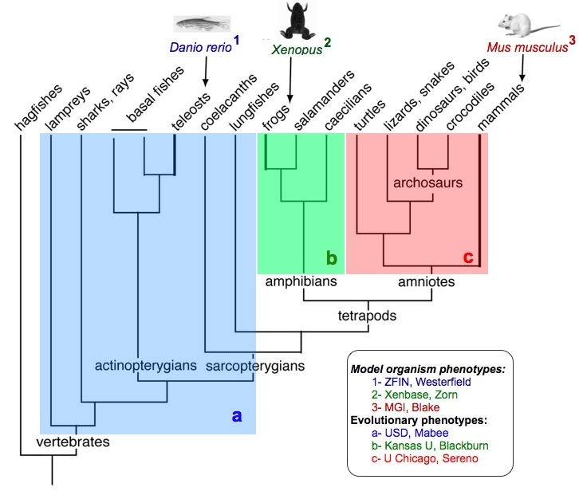
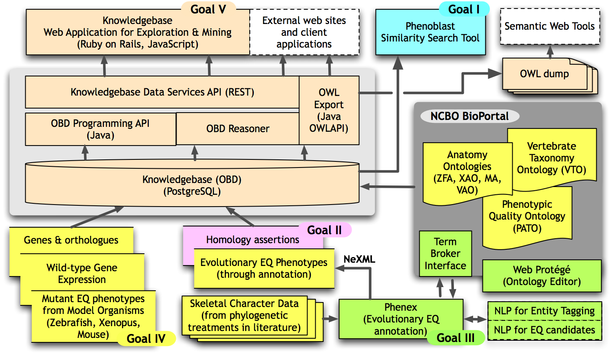

## Ontology-enabled reasoning across phenotypes from evolution and model organisms

### About this project

Our overall objective is to create a scalable infrastructure that
enables linking descriptive phenotype observations across different
fields of biology by the semantic similarity of their free-text
descriptions. In other words, we are trying to make descriptive
observations amenable to large-scale computation so that they can be
subjected to computational data integration and knowledge discovery
techniques in ways similarly powerful as the techniques we are used to
for numeric, quantitative observations.

Our approach to accomplish this centers on transforming descriptive
observations from the natural language text form in which they are
typically reported, to fully computable logic expressions that utilize
terms from shared ontologies.
<a href="Guide_to_Character_Annotation" class="wikilink"
title=" We create these expressions"> We create these expressions</a>
(which we also call "annotations") for evolutionary phenotypes reported
in the systematics literature, typically in the form of character state
matrices. We use the
<a href="EQ_for_character_matrices" class="wikilink"
title=" Entity-Quality (EQ) formalism"> Entity-Quality (EQ)
formalism</a> to compose these expressions, which was initially
conceived for making biomedical and mutant model organism phenotype
observations interoperable.

We combine the EQ annotations we create for evolutionary phenotypes with
the EQ annotations created for the myriad of phenotypes observed for
mutant model organisms in an [integrated
knowledgebase](http://kb.phenoscape.org) (essentially a triple-store).
We then apply <a href="Category%3AReasoning" class="wikilink"
title=" Description Logic-reasoning"> Description Logic-reasoning</a> to
evaluate which evolutionary phenotype transitions can be inferred as
semantically similar to which mutant model organism phenotypes, and vice
versa. Since the genetic cause of a mutant phenotype is usually known,
the links between evolutionary and mutant phenotypes identified in this
way can be used to construct testable hypotheses about the genetic
correlates or causes of evolutionary transitions.

 In a previous project, titled
<a href="Linking_Evolution_to_Genomics_Using_Phenotype_Ontologies"
class="wikilink"
title="Linking Evolution to Genomics Using Phenotype Ontologies">Linking
Evolution to Genomics Using Phenotype Ontologies</a>, we developed a
working prototype as a successful proof-of-concept, using
<a href="Phenoscape_1_Curated_Publications" class="wikilink"
title=" teleost fishes for evolutionary phenotypes"> teleost fishes for
evolutionary phenotypes</a> and the [zebrafish model
organism](http://zfin.org) as a source of mutant phenotypes. Here, we
aim to make the components of the prototype, including tools and
workflows, sufficiently scalable so that they are adequate for the much
more extensive volume and more diverse nature of skeletal phenotypes
across all vertebrates, fossil and modern. Specifically, our aims
encompass the following:

1.  Develop a fast semantic similarity engine so that the integrated
    knowledgebase can be searched on-the-fly for biological taxa or
    genotypes bearing a profile of phenotypes that is similar, but not
    necessarily identical, to a query profile.
2.  Develop an
    <a href="Reasoning_over_homology_statements" class="wikilink"
    title=" ontological framework for reasoning over homology"> ontological
    framework for reasoning over homology</a> that can be scaled to a
    large number of anatomically diverse evolutionary lineages.
3.  Reduce the time and cost of obtaining EQ statements from the
    literature, while at the same time improving the quality and
    consistency of those statements, by incorporating natural language
    processing tools and by improving curation software to allow for
    on-demand augmentation of community ontologies.
    
4.  Build umbrella
    <a href="Ontologies#Vertebrate_Taxonomy_Ontology" class="wikilink"
    title=" taxonomic"> taxonomic</a> and
    <a href="Ontologies" class="wikilink" title=" anatomical ontologies">
    anatomical ontologies</a> for the vertebrates, the latter to be
    supplemented by explicit homology relations among anatomical
    structures.
5.  Create a knowledgebase that integrates evolutionary phenotypes for
    vertebrate fin and limb characters with genetic and phenotype data
    from three vertebrate model organisms: [zebrafish](http://zfin.org)
    (*Danio rerio*), [frog](http://xenbase.org) (*Xenopus laevis*), and
    [mouse](http://www.informatics.jax.org/) (*Mus musculus*).
6.  As a capstone, we will assess the results of our work by how well we
    can apply machine reasoning to retrieve candidate genes for the
    well-studied vertebrate fin-limb transition and other major events
    in skeletal evolution of vertebrates.

In addition to a web-based interface, we will make all data, including
the integrated knowledgebase, available in the Web Ontology Language
(OWL), so that other researchers can reuse the data in as many ways as
possible.

### The vertebrate fin/limb transition: the test system

The evolution of limbs from fins is arguably one of the most well
studied transitions in vertebrate history. The genes involved in
positioning, growth, and patterning of the fin and limb at various
stages are well-known and documented in the vertebrate model organism
databases [ZFIN](http://zfin.org), [Xenbase](http://xenbase.org), and
[MGI](http://www.informatics.jax.org/); changes in skeletal morphology
and corresponding assertions of homology are well-documented in the
comparative morphological literature. Bringing together the genetic,
developmental, morphological and evolutionary data in the Phenoscape
Knowledgebase will provide an ideal test bed for judging the reliability
of candidate gene predictions and the application of homology logic.

### Outreach

Outreach activities include:

- Summer internships in bio-ontologies for undergraduate/graduate
  students, in partnership with the [DeepFin Research Coordination
  Network](http://www.deepfin.org/)
- A "Junior Biocurator" program for advanced Chicago public high school
  students to be implemented by [Project
  Exploration](http://www.projectexploration.org/).
- Undergraduate internship and community outreach to the Native American
  population through University of South Dakota programs.

### Contacts

Paula Mabee (University of South Dakota) and Todd Vision (University of
North Carolina Chapel Hill, National Evolutionary Synthesis Center) are
the Principal Investigators of this project. Co-principal investigators
are David Blackburn (California Academy of Sciences), Judith Blake
(Mouse Genome Informatics, Jackson Laboratories), Hilmar Lapp (National
Evolutionary Synthesis Center), Paul Sereno (University of Chicago),
Monte Westerfield (ZFIN, University of Oregon), and Aaron Zorn (Xenbase,
Cincinnati Children's Hospital Medical Center) (see their
<a href="Contact" class="wikilink" title=" contact addresses"> contact
addresses</a>).
