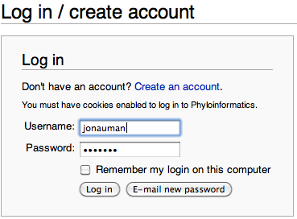
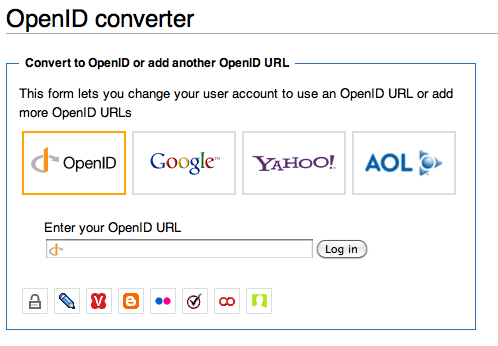

## Logging in with OpenID

This wiki now accepts [OpenID](http://en.wikipedia.org/wiki/Openid)
logins. Many [popular websites now provide
OpenIDs](http://openid.net/get/), like Google, Yahoo, Flickr, and more.

If you have an OpenID, or if you have an account at any of the providers
named above, you can use it to login to this wiki. Simply use the
**<a href="Special:OpenIDLogin" class="wikilink"
title="Login with OpenID">Login with OpenID</a>** link in the upper
right corner. If you already have an account on this wiki and would like
to **convert to using OpenID**, please follow the instructions below.

## Instructions for converting to OpenID

1.  Login to the wiki in the way you have been before. Use NetID if you
    did so before, and if you used a local account, login through the
    normal login page (<a href="Special:UserLogin" class="wikilink"
    title="Special:UserLogin">Special:UserLogin</a>). If you have
    forgotten your password, or if you were using NetID and NetID is now
    disabled, only enter your username and click "E-mail new password".
    If you need your password but do not have an email account
    associated with your user account, please send a help request to
    support@nescent.org.
2.  Once logged in, go to this page:
    <a href="Special:OpenIDConvert" class="wikilink"
    title="Special:OpenIDConvert">Special:OpenIDConvert</a>
3.  Click on the icon for the provider of your choice, or enter the
    OpenID URL in the box if you know it.
4.  You will be redirected to login at your provider's website (unless
    you are already logged in) and should see a message stating that the
    conversion was successful.
5.  Next time you login to the wiki, use the
    "<a href="Special:OpenIDLogin" class="wikilink"
    title="Login with OpenID">Login with OpenID</a>" icon instead of the
    normal login link.

## Alternative instructions

In some instances, the instructions above may not work for you. This is
usually caused by logging in with a **new** OpenID before logging in to
your regular account. If this is the case, you will be presented with a
dialogue to match the current OpenID with an existing user or create a
new username. If you want to connect this OpenID with an existing user,
you will need to know your current password. If you do not know it, you
should cancel the OpenID login and go to the normal login/account
creation page and ask the system to email you a temporary password. Then
you may retry the OpenID login.

