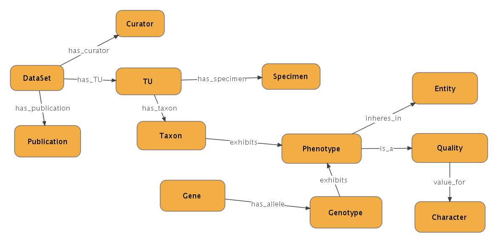

The Phenoscape data repository is a relational database, which holds
phenotypic data from the model organism *Danio Rerio* (Zebrafish) and
the evolutionary organisms belong to the clade of
[Ostariophysi](http://tolweb.org/Ostariophysi/15077). This page
describes the schema of this data repository and outlines the methods to
load and query this data repository.

## Data Repository

The Phenoscape data repository has been implemented as a
[PostgreSQL](http://www.postgresql.org/) relational database, and at
present is housed on a dedicated database server.

## Schema

The schema of the Phenoscape data repository is based upon the Open
Biomedical Database (OBD) data format developed at the [Berkeley
Bioinformatics Open-source Projects
(BBOP)](http://www.berkeleybop.org/). OBD is based upon the [Resource
Description Framework (RDF)](http://www.w3.org/RDF) format for capturing
metadata about Web (and Semantic Web) resources such as Web pages and
Web services.

The philosophy of OBD is to represent every conceptual entity, be it a
type or a token (synonymously a class or an object, or a concept or an
instance) or a relation definition, as a Node. Instances of relations
between these nodes are represented as Statements, specifically Link
Statements. OBD also allows for
[reification](http://en.wikipedia.org/wiki/Reification_(computer_science)),
which is vital to the life sciences with their emphasis on evidence
codes and attributions (provenance). For this purpose, OBD provides
Literal Statements (and Annotation Statements) to capture metadata about
Nodes and Link Statements, such as the source publication, evidence
codes, specimens used, and so forth.

### Tables

Two relational tables are central to the schema of the Phenoscape data
repository. These are: LINK and NODE. The SQL commands for the creation
of these tables (and the others) can be found at this [Phenoscape
Sourceforge](http://phenoscape.svn.sourceforge.net/viewvc/phenoscape/trunk/src/Database/sql/obd/obd-core-schema.sql?view=markup)
page.

#### The NODE table

The NODE table contains information about every concept such as its
unique identifier, label, and source ontology. The NODE table contains
this information about concepts extracted from the source
<a href="Ontologies" class="wikilink" title="Ontologies">Ontologies</a>.
In addition, it also holds information about scientific publications (in
a rudimentary format which will be improved upon soon), the ontologies
themselves, and the representation of phenotypes from the ZFIN and NeXML
databases. It will be augmented in the future to hold information about
collection specimens. The NODE table adds a unique identifier (generated
from a sequence) of its own to every row. An excerpt of the row from the
NODE table for the *Gymnotiformes* term is shown below

<javascript>

`node_id |   uid    |     label     | metatype | source_id`

---------+----------+---------------+----------+-----------

`  46050 | TTO:1390 | Gymnotiformes | C        |      9630`

</javascript>

- The NODE_ID column holds the unique identifier generated by the
  Phenoscape database for this term
- The UID column holds the identifier of this term that is obtained from
  the Teleost Taxonomy Ontology (TTO). The 'TTO' is the namespace prefix
- The LABEL column displays the label for this term
- The METATYPE column shows term is a Class (C). Other metatypes are
  Relation (R) and Instance (I).
- The SOURCE_ID column holds the NODE_ID of the ontology from which the
  term was extracted. In this case, the source ontology is the TTO

#### The LINK table

The LINK table contains rows which represent Statements which link the
Nodes to one another, and also the metadata about these Nodes. The
excerpt below shows some of the rows in the LINK table about the
Gymnotiformes term

<javascript>

link_id \| node_id \| predicate_id \| object_id
---------+---------+--------------+-----------

`  23854 |    9637 |          102 |     46050`  
`  59897 |   45723 |          102 |     46050`  
`  60223 |   46050 |          102 |     46160`  
` 501448 |    9932 |          102 |     46050`

</javascript>

- The LINK_ID column shows the database generated identifier for the
  link
- The NODE_ID column shows the Subject of the Statement (in RDF
  parlance). This ID the is database generated identifier for the
  concept *Eigenmanniidae* (TTO:10000005)
- The PREDICATE_ID column shows the Predicate of the Statement. This ID
  is the database generated identifier for the relation *OBO_REL:is_a*.
- The OBJECT_ID column shows the Object of the Statement which is the ID
  generated by the database for concept *Gymnotiformes*

In simple terms, a sub species of Gymnotiformes is displayed by this
Statement as shown in the triple below

<javascript>

`     Eigenmanniidae                                is_a                        Gymnotiformes`

</javascript>

Similarly, The third row in the display shows that Gymnotiformes is an
Otophysian as shown below

<javascript>

`     Gymnotiformes                                is_a                        Otophysi`

</javascript>

#### Other important tables

- The ALIAS table keeps track of the various aliases (alternate labels)
  of the concepts and relations, which are sourced from the ontologies
- The DESCRIPTION table stores rich text descriptions of the concepts
  and relations, which are extracted from the ontologies
- The OBD_SCHEMA_METADATA stores metadata about OBD such as the version
  of the OBD format in use, and also the last refresh date and time for
  the database

### Views

The Phenoscape data repository also generates several views from the
tables. These views are used in querying the database, some of which are
part of the
<a href="OBD_API_Documentation" class="wikilink" title=" OBDAPI">
OBDAPI</a>

### Procedures

Stored procedures are used in populating the database with defined terms
from the ontologies, and with phenotypic descriptions obtained from
curators. In addition, they are also used in generating inferences from
the asserted data. In the future, stored procedures may be used as
necessary for speedier data retrieval.

## Loading the data

The repository will be periodically refreshed to include the latest
ontology definitions and curated data. At present, curated data is
obtained from two different source which are:

1.  The ZFIN data repository (model organism database) containing
    descriptions of mutant phenotypes and the related genes and
    genotypes of zebrafish. This data exists primarily as tab delimited
    simple text files
2.  Annotations from a set of selected publications, which describe in
    rich-text unstructured format, the observed phenotypes of about
    25000 different species of fish belonging to the clade of
    Ostariophysi. These annotations are entered by curators using the
    <a href="Phenex" class="wikilink" title="Phenex">Phenex</a>
    annotation tool and are saved in the
    <a href="http://www.nexml.org/_NeXML" class="wikilink"
    title="http://www.nexml.org/ NeXML">http://www.nexml.org/ NeXML</a>
    data format.

A complete database refresh using the
<a href="Phenoscape_data_loader" class="wikilink"
title="Phenoscape data loader">Phenoscape data loader</a> can be started
off by running the "refresh-database" target in the Ant build file in
the 'Phenoscape' folder of the [OBDAPI
project](https://obo.svn.sourceforge.net/svnroot/obo/OBDAPI/trunk).

## Querying the data

Queries have been implemented for retrieving phenotype information
(summaries and details), homology information, summaries of search
terms, metadata about phenotype assertions, and auto complete
suggestions for search terms as they are being entered. Data retrieved
by these queries are accessed by the various
<a href="Data_Services" class="wikilink"
title=" Phenoscape data services"> Phenoscape data services</a>. The
details about these queries are presented here.

### Relations of interest

This section discusses the various entities and binary directed links
between these entities, which are leveraged by the database queries.
Assertions about the model organism (from ZFIN) and the evolutionary
species are converted into the *exhibits* link specified in (1) below.
Note the right hand side of the *exhibits* link. It is a post
composition of an Entity and a Quality, which makes up a description of
a phenotype.

<javascript> Taxon exhibits inheres_in(Quality, Entity) --(1)
</javascript>

The post composed phenotype is related to its components by the *is_a*
and the *inheres_in* relation as shown in (2) and (3) below

<javascript> inheres_in(Quality, Entity) inheres_in Entity --(2)
inheres_in(Quality, Entity) is_a Quality --(3) </javascript>

The Quality is related to a Character by an inferred *value_for*
relation as shown in (4)

<javascript> Quality value_for Character --(4) </javascript>

An example should make this clearer. Consider the statement, "In
Siluriformes, the shape of the dorsal surface of the basihyal bone is
flat or convex" from \[Albert, 2001\]. This statement can be represented
as in (1ex) below. Note the similar form to (1). Siluriformes is the
taxon, flat is the quality, and basihyal bone is the entity.

<javascript> Siluriformes exhibits inheres_in(flat, basihyal bone)
--(1ex) </javascript>

Now the post composed phenotype is related to its entity and quality
components as in (2ex) and (3ex). Note the similarity to (2) and (3)

<javascript> inheres_in(flat, basihyal bone) inheres_in basihyal bone
--(2ex) inheres_in(flat, basihyal bone) is_a flat --(3ex) </javascript>

Finally, the quality 'flat' is related to the character 'shape' by
(4ex). Note that 'flat' is just one of the values for 'shape'. Other
values my be 'rounded', 'curved', etc.

<javascript> flat value_for shape --(4ex) </javascript>

Moving on, the database also stores provenance information (metadata)
about the assertion that Siluriformes exhibits flat basihyal bones. AT
the very minimum, we need to know the publication from which the
assertion was extracted. If the curators have specifically cited the
text from the publication which forms the basis of their assertion, we
need to know that as well.

The database provides a handle to access this metadata from the
assertion itself. The LINK table includes a reiflink_node_id attribute,
from which publication, curator names, character and state text, and all
other relevant metadata can be accessed. Without going into more
database specific details, conceptually the statement (1ex) is linked to
a reification identifer, which is linked to the actual metadata.
Transparently, the statement (1ex) can be linked with a publication as
shown in (5ex) below. The linkage to the other facets of the metadata is
done similarly.

<javascript> (1ex) posited_by Albert, 2001 --(5ex) </javascript>

The schema of the relations is shown below

### Speeding up the queries: The data warehouse

Queries used in the Phenoscape data services module were found to be
intolerably slow in returning, esp. when asked to retrieve and
<a href="Data_Services#Annotations_summary" class="wikilink"
title=" summarize annotation data"> summarize annotation data</a> for
genes and teleost species. The slow times in query execution were
primarily due to the large numbers of JOINs in them, and the extensive
volume of data, which needed to be processed in various facets of the
query execution plan.

To address this issue, it was decided to create summaries of the
annotations in the database in simple data warehouse tables. New queries
which were tested on these summary tables executed much faster, having
dispensed with the numerous JOINs between the
<a href="#The_NODE_table" class="wikilink" title=" NODE"> NODE</a> and
<a href="#The_LINK_table" class="wikilink" title=" LINK"> LINK</a>
tables, aliased several times over.

#### <a href="conceptual_schema" class="wikilink"
title=" The data warehouse schema "> The data warehouse schema </a>

The data warehouse has been designed with the intent of maximizing the
efficiency of queries executed on the Phenoscape knowledge base. For
phenotype queries, we need to know the phenotype in question, the taxa
or genes which are associated with that phenotype, as well as the entity
and quality associated with that phenotype. We also need to find the
character, which the quality is associated with. For example if the
quality is *reduced number of*, the character in question would be
*count*.

To effectively execute this query, the phenotype centric model of the
data warehouse is designed as follows (concepts and attributes are
capitalized). A taxon or gene may be associated with one or more
PHENOTYPE(s) and a PHENOTYPE may be associated with one or more genes or
taxa. A PHENOTYPE is associated with exactly one ENTITY and one QUALITY.
A QUALITY may be associated with one or more PHENOTYPE(s). Further, a
QUALITY is associated with exactly one CHARACTER, which is a QUALITY as
well.

For queries for provenance data about taxon to phenotype assertions, we
need to find the publication the assertion is extracted from, the
specific text from the publication about character and state, as well as
the curators' comments about the assertion.

To effectively execute these 'metadata' queries, the provenance data is
modeled as an association attribute. For every instance of the
association between a TAXON and a PHENOYPE, we capture CHARACTER. STATE,
CURATORS, and PUBLICATION. The PUBLICATION entity with all its
attributes is linked to the REIF entity, which is the link to the
metadata of the TAXON and PHENOTYPE.

This data warehouse can be reduced to the logical schema shown below

<table width=500 align=left border=1>

<tr>

<td align=left colspan=3>

<b>Gene</b>

</td>

</tr>

<tr>

<td align=center>

Gene_id {PK}

</td>

<td align=center>

Gene_Uid

</td>

<td align=center>

Gene_Label

</td>

<tr>

</table>

  
  
  
  

<table width=500 align=left border=1>

<tr>

<td align=left colspan=2>

<b>Gene_Alias</b>

</td>

</tr>

<tr>

<td align=center>

Gene_id{FK}

</td>

<td align=center>

Alias

</td>

<tr>

</table>

  
  
  
  

<table width=500 align=left border=1>

<tr>

<td align=left colspan=3>

<b>Genotype</b>

</td>

</tr>

<tr>

<td align=center>

Genotype_id{PK}

</td>

<td align=center>

Genotype_Uid

</td>

<td align=center>

Genotype_Label

</td>

<tr>

</table>

  
  
  
  

<table width=700 align=left border=1>

<tr>

<td align=left colspan=3>

<b>Taxon</b>

</td>

</tr>

<tr>

<td align=center>

Taxon_id {PK}

</td>

<td align=center>

Taxon_Uid

</td>

<td align=center>

Taxon_Label

</td>

<tr>

</table>

  
  
  
  

<table width=700 align=left border=1>

<tr>

<td align=left colspan=2>

<b>Taxon_Alias</b>

</td>

</tr>

<tr>

<td align=center>

Taxon_id {FK}

</td>

<td align=center>

Alias

</td>

<tr>

</table>

  
  
  
  

<table width=700 align=left border=1>

<tr>

<td align=left colspan=2>

<b>Taxon_Is_A_Taxon</b>

</td>

</tr>

<tr>

<td align=center>

Taxon_id{FK}

</td>

<td align=center>

Taxon_id{FK}

</td>

<tr>

</table>

  
  
  
  

<table width=700 align=left border=1>

<tr>

<td align=left colspan=3>

<b>Entity</b>

</td>

</tr>

<tr>

<td align=center>

Entity_Id {PK}

</td>

<td align=center>

Entity_Uid

</td>

<td align=center>

Entity_Label

</td>

<tr>

</table>

  
  
  
  

<table width=700 align=left border=1>

<tr>

<td align=left colspan=2>

<b>Entity_Is_A_Entity</b>

</td>

</tr>

<tr>

<td align=center>

Entity_Id {FK}

</td>

<td align=center>

Entity_Id {FK}

</td>

<tr>

</table>

  
  
  
  

<table width=700 align=left border=1>

<tr>

<td align=left colspan=2>

<b>Entity_Part_Of_Entity</b>

</td>

</tr>

<tr>

<td align=center>

Entity_Id {FK}

</td>

<td align=center>

Entity_Id {FK}

</td>

<tr>

</table>

  
  
  
  

<table width=700 align=left border=1>

<tr>

<td align=left colspan=3>

<b>Quality</b>

</td>

</tr>

<tr>

<td align=center>

Quality_Id {PK}

</td>

<td align=center>

Quality_Uid

</td>

<td align=center>

Quality_Label

</td>

<tr>

</table>

  
  
  
  

<table width=700 align=left border=1>

<tr>

<td align=left colspan=7>

<b>Phenotype</b>

</td>

</tr>

<tr>

<td align=center>

Phenotype_Id {PK}

</td>

<td align=center>

Phenotype_Uid

</td>

<td align=center>

Inheres_In_Entity_id {FK}

</td>

<td align=center>

Towards_Entity_id {FK}

</td>

<td align=center>

Is_A_Quality_id {FK}

</td>

<td align=center>

Is_A_Character_id {FK}

</td>

<td align=center>

Has_count

</td>

<tr>

</table>

  
  
  
  

<table width=300 align=left border=1>

<tr>

<td align=left colspan=3>

<b>Gene_Genotype_Phenotype</b>

</td>

</tr>

<tr>

<td align=center>

Gene_Id {FK}

</td>

<td align=center>

Genotype_Id {FK}

</td>

<td align=center>

Phenotype_Id {FK}

</td>

<tr>

</table>

  
  
  
  

<table width=300 align=left border=1>

<tr>

<td align=left colspan=3>

<b>Taxon_Phenotype</b>

</td>

</tr>

<tr>

<td align=center>

Taxon_Id {FK}

</td>

<td align=center>

Phenotype_Id {FK}

</td>

<td align=center>

Reif_Id {FK}

</td>

<tr>

</table>

  
  
  
  

<table width=300 align=left border=1>

<tr>

<td align=left colspan=5>

<b>Taxon_Phenotype_Metadata</b>

</td>

</tr>

<tr>

<td align=center>

Reif_Id {PK}

</td>

<td align=center>

Character_Text

</td>

<td align=center>

State_Text

</td>

<td align=center>

Curators

</td>

<td align=center>

Curator_Comments

</td>

<tr>

</table>

  
  
  
  

<table width=300 align=left border=1>

<tr>

<td align=left colspan=7>

<b>Publication</b>

</td>

</tr>

<tr>

<td align=center>

Publication {PK}

</td>

<td align=center>

Primary_Title

</td>

<td align=center>

Secondary_Title

</td>

<td align=center>

Pages

</td>

<td align=center>

Volume

</td>

<td align=center>

Abstract

</td>

<td align=center>

Year

</td>

<tr>

</table>

  
  
  
  

<table width=300 align=left border=1>

<tr>

<td align=left colspan=2>

<b>Publication_Reif_id</b>

</td>

</tr>

<tr>

<td align=center>

Publication {FK}

</td>

<td align=center>

Reif_Id {FK}

</td>

<tr>

</table>
