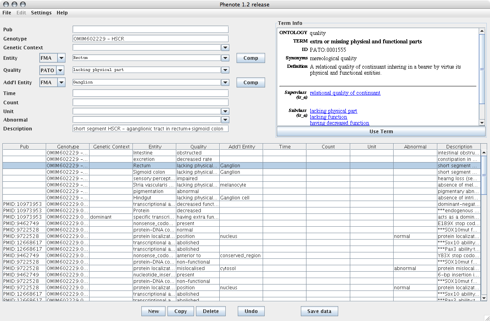

[Phenote](http://www.phenote.org/) is being used for phenotype
annotation of mutants within model-organism projects. It allows the
creation of a simple list of phenotype statements, rather than a
species-by-character matrix.

Here is sample data in the default configuration:

<figure>

<figcaption>Phenote-default.png</figcaption>
</figure>

The input fields in Phenote are highly configurable. Here is a sample of
how Phenote might be configured for the PhenoScape project:

<figure>

<figcaption>Phenote-phenomap.png</figcaption>
</figure>

This configuration file can be downloaded
<a href="Media:phenomap.cfg.zip" class="wikilink" title="here">here</a>.
Phenote configurations are described in the
[documentation](http://www.phenote.org/content/howtos/customize.shtml).

This interface ("list of states") may not be optimal for the PhenoScape
project, especially if a set of species are expected to be coded for a
given set of characters.
