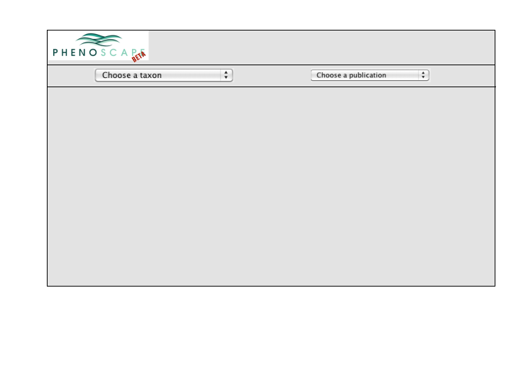

# Map Qualities on Tree

## Version 3

### Access from Entity Page via tree button

<figure>

<figcaption>MapQualities1.png</figcaption>
</figure>

### Display Qualities One at a time using a Scroll

<figure>

<figcaption>MapQualities3a.png</figcaption>
</figure>

## Version 2

### Access from Entity Page via tree button

<figure>

<figcaption>MapQualities1.png</figcaption>
</figure>

<figure>

<figcaption>MapQualities2.png</figcaption>
</figure>

### Taxonomic Scope

### Display qualities using a grid of colored tiles

- Qualities are displayed with consistent location and color in the grid
- Desaturated colors are used for qualities of phenotypes that are
  inferred, rather than annotated
  - Note annotation to Ictaluridae in this and next candidate example
- The 16 tile designs are intended to support expansion of the list of
  qualities used in curation - as has already happened.

<figure>

<figcaption>ColorGridOption1.png</figcaption>
</figure>

### Display qualities using icons strung along branches

- Qualities are displayed with consistent icon, color and relative
  position along branches
- As above, desaturated colors are used for inferred qualities
- Additional icons may be added

<figure>

<figcaption>IconsOnBranchOption.png</figcaption>
</figure>

## Version 1

### Display qualities using a grid of colored tiles

- Qualities are displayed with consistent location and color in the grid
- Desaturated colors are used for qualities of phenotypes that are
  inferred, rather than annotated
  - Note annotation to Ictaluridae in this and next candidate example
- The 16 tile designs are intended to support expansion of the list of
  qualities used in curation - as has already happened.

<figure>

<figcaption>ColorGridOption1.png</figcaption>
</figure>

### Display qualities using colored icons strung along branches

- Qualities are displayed with consistent icon, color and relative
  position along branches
- As above, desaturated colors are used for inferred qualities
- Additional icons may be added

<figure>

<figcaption>IconsOnBranchOption.png</figcaption>
</figure>

## Version 0

### Display qualities using text icons adjacent to taxon names

- user enters any entity term
- each of the standard upper-level PATO qualities has some icon
- each node of tree is annotated with icons for which kinds of
  phenotypes are exhibited by that node
- so if you just put in "bone", you could get a "shape" icon at a node
  for any bone shape phenotype (basihyal bone round, vertebra 1 flat,
  etc.)

<figure>

<figcaption>trees3.png</figcaption>
</figure>
