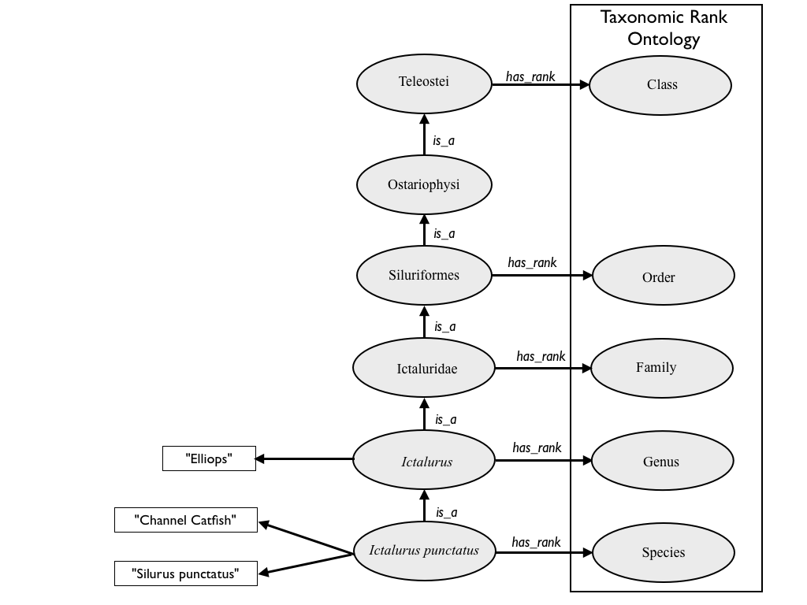

## Summary

This is an ontology of taxonomic terms (names of taxonomic groups) used
in the systematics of fish, including non-teleost groups such as
Chondrichthys (sharks and rays), Sarcopterygii (lungfish and
coelacanths), lampreys, and hagfish. It contains (as of August 2010)
over 38,500 names, and over 44,000 taxonomic synonyms. A majority of the
taxonomic names and synonyms were made available from the [Catalog of
Fishes](http://research.calacademy.org/redirect?url=http://researcharchive.calacademy.org/research/ichthyology/catalog/fishcatmain.asp).
In July 2010 we added nearly 15,000 common names provided by
[Fishbase](http://www.fishbase.org). Additional names and synonyms are
added as a result of our curation activities.

Details of changes are recorded in the
<a href="TTO_Changes" class="wikilink"
title="TTO_Changes">TTO_Changes</a> page, (though this is not frequently
updated), and summarized in the cvs commit comments.

The current release may be found
[here](http://obo.cvs.sourceforge.net/viewvc/obo/obo/ontology/taxonomy/teleost_taxonomy.obo).

## License

[<https://i.creativecommons.org/l/zero/1.0/80x15.png>](https://creativecommons.org/publicdomain/zero/1.0/)

To the extent possible under law, Peter E. Midford has waived all
copyright and related or neighboring rights to the **Teleost Taxonomy
Ontology** (TTO). This work is published from the United States.

## Organization

<figure>

<figcaption>TTO_org.png</figcaption>
</figure>

### List of term and database identifier prefixes

- **TTO:** Term defined in the TTO
- **NCBITaxon:** ID from NCBI taxonomy database
- **CASSPC:** ID from the Catalog of Fishes species table (CAS =
  California Academy of Sciences)
- **CASGEN:** ID from the Catalog of Fishes genus table
- **TAXRANK:** Term defined in the Taxonomic Rank Vocabulary
- **urn:** URN from external resource, generally an
  [lsid](http://lsids.sourceforge.net/) from
  [GNI](http://gni.globalnames.org/).

### List of Relations and Synonym Types

| Name | Relation or Synonym | Notes |
|----|----|----|
| COMMONNAME | synonym type | synonymous common name |
| MISSPELLING | synonym type | synonym resulting from identifiable misspelling |
| TAXONNAMEUSAGE | synonym type | synonym that includes an (author year) citation |
| property_value: has_rank | metadata relation | links taxa to ranks |
| property_value: is_extinct | boolean metadata relation | indicates taxa only known from fossils |
|  |  |  |

#### Notes

- The taxonomic rank specified by the has_rank relation is specified by
  its identifier. The most common are TAXRANK:0000004 (family),
  TAXRANK:0000005 (genus), TAXRANK:0000006 (species).
- In general TTO does not assign intermediate ranks (e.g., subclass).
  There are a few exceptions that may be removed.
- At present is_extinct does not include recently extinct taxa.
