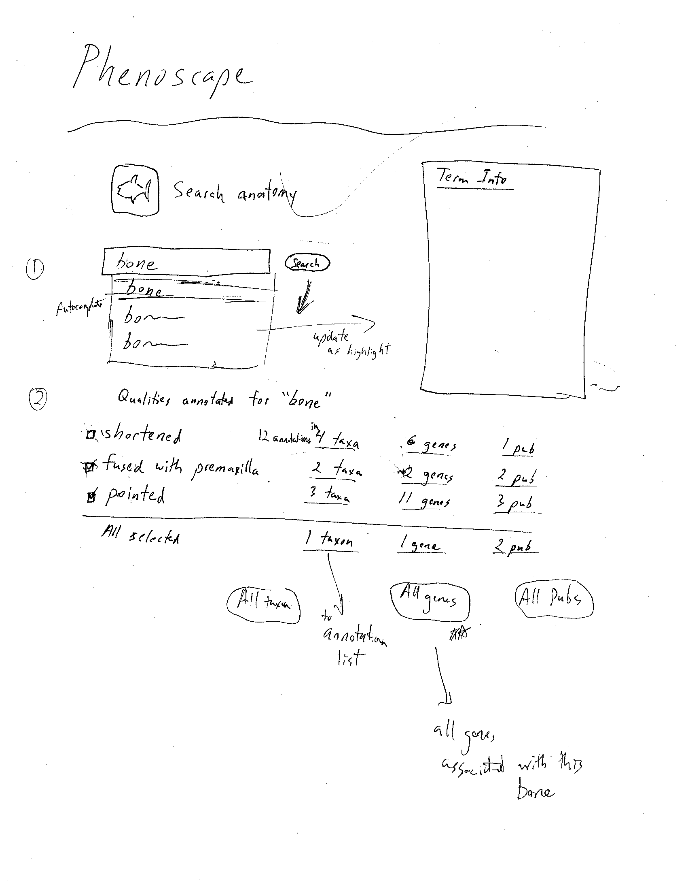

Specifications for an initial implementation of the Phenoscape web user
interface. Drawings of these interfaces can be found
<a href="Web_UI_mockups" class="wikilink" title="here">here</a>.

## Entry page

Start with 4 search entry points:

- Anatomy
- Taxonomy
- Genes
- Publications

After clicking one of the entry points, the page dynamically displays a
corresponding search interface.

### Anatomy

<figure>

<figcaption>Web_search_anatomy.png</figcaption>
</figure>

- User is presented with a search field, which autocompletes terms from
  the anatomy ontology.
- As terms are highlighted in the autocomplete field, a term info panel
  displays metadata.
- Once an anatomy term has been selected, the user can press a Search
  button to retrieve a <a href="#Anatomy_summary_page" class="wikilink"
  title="summary of database results">summary of database results</a>
  about that term.

### Taxonomy

<figure>

<figcaption>web_search_taxonomy.png</figcaption>
</figure>

- User is presented with a search field, which autocompletes terms from
  the taxonomy ontology.
- As terms are highlighted in the autocomplete field, a term info panel
  displays metadata.
- Once a taxonomy term has been selected, the user can press a Search
  button to retrieve a <a href="#Taxonomy_summary_page" class="wikilink"
  title="summary of database results">summary of database results</a>
  about that term.

### Genes

<figure>

<figcaption>web_search_genes.png</figcaption>
</figure>

- User is presented with a search field, which autocomplete gene and
  genotype names in the manner of the ZFIN web interface.
- Pressing Search button sends user to a
  <a href="#Gene_summary_page" class="wikilink"
  title="summary of database results">summary of database results</a>
  about that term.

### Publications

## Anatomy summary page

Summary is grouped into rows lumped by qualities.

- For each quality, there are 3 columns:
  - n annotations in p taxa
  - n annotations in p genes
  - n annotations in p publications
- There is also a checkbox next to each row - the user can select rows,
  and view the annotations summary counts for the intersection of the
  selected rows.
- There are also buttons or links to view annotations for "All Taxa",
  "All Genes", or "All Pubs".
- All of these annotation count summaries are links to annotation list
  pages.

## Taxonomy summary page

Summary is grouped by anatomy terms, and then qualities within. Within
each anatomy term grouping, the display is the same as the anatomy
search results.

- The anatomy term "header" acts as a row in the table displaying the
  union of the results for the qualities within it.

## Gene summary page
